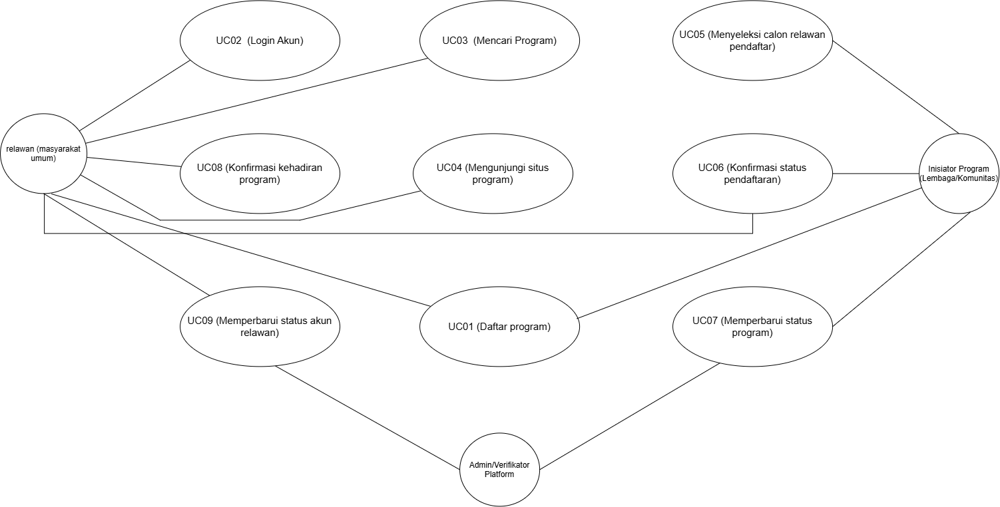

<h1>
IF2150 REKAYASA PERANGKAT LUNAK
 
TUGAS 3
 
USE CASE & SCENARIO USE CASE
</h1>
 

## RekanBumi

### Untuk: Stefani Angeline Oroh

Dipersiapkan oleh:
| Informasi | Keterangan |
| --- | --- |
| Kelas | K03 |
| Kelompok | G01  |

| NIM | Nama |
|---|---|
| 13525018 | Avicenna Ananda Musthafa |
| 13525045 | Ribka Kaylena Sanjaya |
| 13525063 | Kairenzo Vemil |
| 13525069 | Mulky Siraj Firizqi |
| 13525144 | Three Gie Gendhis Sekar Ayoe Jatmiko |
---

## Daftar Perubahan

| Revisi | Deskripsi |
| :--- | :--- |
| *A* | *Deskripsikan perubahan yang dilakukan dari dokumen sebelumnya pada dokumen ini. Jika tidak terdapat perubahan, harap kosongkan tabel.* |
| *B* |  |
| *C* |  |
| ... |  |

 
 

# BAB 1: Deskripsi Perangkat Lunak
Bagian ini boleh disalin dari 1.1 Deskripsi Umum Sistem pada dokumen *Requirement Gathering*. Pastikan isinya memang membahas deskripsi perangkat lunak kalian, seperti fitur, fungsi utama, dan cakupan sistem.

RekanBumi adalah platform web yang mempertemukan masyarakat umum dengan lembaga lingkungan terverifikasi untuk memfasilitasi aksi nyata lewat program "Jaga Alam" dan "Jaga Iklim". Dari sudut pandang pengguna, relawan mengekspektasikan kemudahan mencari kegiatan terstruktur yang sesuai preferensi lokasi dan waktu, sementara lembaga membutuhkan sarana untuk meningkatkan visibilitas program serta mengelola perekrutan relawan secara transparan. Alur kerja sistem berjalan mulai dari verifikasi legalitas lembaga dan kurasi program oleh Admin, dilanjutkan dengan pencarian serta pendaftaran kegiatan oleh relawan, hingga pelaksanaan lapangan dan pencatatan riwayat aksi secara otomatis. Solusi ini diharapkan dapat menjembatani tingginya kepedulian masyarakat dengan sarana kontribusi yang jelas guna mempercepat pencapaian SDG 13 dan SDG 15 di Indonesia.

---

# BAB 2: Kebutuhan Fungsional (KF)
Salin ulang **seluruh Kebutuhan Fungsional (KF)** yang telah didefinisikan pada dokumen *Requirement Gathering*. Tabel ini menjadi acuan *traceability*, dimana setiap Use Case pada BAB 3 wajib ditelusuri ke satu atau lebih ID KF di tabel ini, dan sebaliknya setiap KF idealnya tercakup oleh minimal satu Use Case. Pastikan juga sudah menggunakan **format EARS** dalam penulisan KF.

| ID KF | ID Kebutuhan | Penjelasan |
| :--- | :--- | :--- |
| KF01 | R02 | Perangkat lunak dapat menyediakan area pengunggahan file yang mendukung metode *drag-and-drop* |
| KF02 | R02 | Perangkat lunak dapat menerima dokumen yang diunggah melalui fitur *upload* dan *drag-and-drop* |
| KF03 | R02 | Perangkat lunak dapat menampilkan pemberitahuan mengenai keberhasilan atau kegagalan proses pengunggahan file |
| KF04 | R04 | Perangkat lunak dapat menyediakan kolom untuk memasukkan tautan situs web resmi lembaga pada deskripsi program |
| KF05 | R04 | Perangkat lunak dapat menampilkan tautan situs web resmi lembaga pada halaman informasi program |
| KF06 | R05 | Perangkat lunak dapat menyimpan tautan situs web resmi yang diberikan oleh lembaga sebagai bagian dari informasi program |
| KF07 | R06 | Perangkat lunak dapat menyediakan kolom pencarian untuk menerima keyword dari pengguna |
| KF08 | R06 | Perangkat lunak dapat menampilkan program yang sesuai dengan keyword pencarian pengguna |
| KF09 | R07 | Perangkat lunak dapat menyediakan pilihan kategori “Jaga Alam” dan “Jaga Iklim” untuk memfilter program |
| KF10 | R07 | Perangkat lunak dapat menampilkan program berdasarkan kategori yang dipilih pengguna |
| KF11 | R08 | Perangkat lunak dapat mendeteksi ketika kuota relawan suatu program telah terpenuhi |
| KF12 | R08 | Perangkat lunak dapat menolak permohonan pendaftaran relawan apabila kuota program telah terpenuhi |
| KF13 | R09 | Perangkat lunak dapat mengharuskan calon relawan untuk melakukan login sebelum mendaftarkan diri pada suatu program |
| KF14 | R10 | Perangkat lunak dapat menyediakan kolom untuk memasukkan catatan keterampilan atau ketersediaan waktu calon relawan |
| KF15 | R10 | Perangkat lunak dapat menyimpan catatan keterampilan atau ketersediaan waktu yang diberikan calon relawan pada permohonan pendaftaran |
| KF16 | R12 | Perangkat lunak dapat menampilkan daftar calon pendaftar beserta data dasar yang diperlukan kepada inisiator program |
| KF17 | R13 | Perangkat lunak dapat mengirimkan notifikasi kepada relawan mengenai status pendaftarannya |
| KF18 | R14 | Perangkat lunak dapat menyediakan pilihan status “Diterima” dan “Ditolak” bagi inisiator dalam menentukan hasil seleksi calon relawan |
| KF19 | R14 | Perangkat lunak dapat menyimpan status seleksi calon relawan yang ditetapkan oleh inisiator |
| KF20 | R15 | Perangkat lunak dapat memeriksa kelengkapan data diri calon relawan sebelum permohonan pendaftaran dikirimkan |
| KF21 | R15 | Perangkat lunak dapat memeriksa status verifikasi akun calon relawan sebelum permohonan pendaftaran dikirimkan |
| KF22 | R17 | Perangkat lunak dapat menyediakan fitur check-in bagi relawan yang telah diterima pada suatu program |
| KF23 | R17 | Perangkat lunak dapat mencatat waktu check-in relawan ketika melakukan konfirmasi kehadiran |
| KF24 | R18 | Perangkat lunak dapat membatasi fitur check-in hanya kepada relawan yang telah diterima pada program terkait |
| KF25 | R18 | Perangkat lunak dapat membatasi akses fitur check-in berdasarkan rentang waktu pelaksanaan kegiatan |
| KF26 | R18 | Perangkat lunak dapat menolak proses check-in yang dilakukan di luar rentang waktu pelaksanaan kegiatan |
| KF27 | R20 | Perangkat lunak dapat menyediakan fitur untuk mengunggah dokumentasi akhir kegiatan |
| KF28 | R20 | Perangkat lunak dapat menyediakan tombol untuk mengubah status kegiatan menjadi “Selesai” |
| KF29 | R24 | Perangkat lunak dapat secara otomatis menambahkan program yang telah selesai ke dalam riwayat portofolio relawan |
| KF30 | R24 | Perangkat lunak dapat secara otomatis mencatat dan memperbarui akumulasi jam aksi relawan setelah kegiatan berstatus selesai |
| KF31 | R25 | Perangkat lunak dapat menyimpan ringkasan capaian dampak lingkungan dari setiap program |
| KF32 | R25 | Perangkat lunak dapat menampilkan ringkasan capaian dampak lingkungan pada halaman publik program |

 ***Catatan***: *Jika ada KF dari ML2 yang berubah/bertambah/dihapus setelah asistensi, pastikan tabel ini konsisten dengan versi KF terbaru sebelum dikumpulkan.*

---

# BAB 3: Model Use Case

## 3.1 Identifikasi Aktor
Daftarkan seluruh aktor yang terlibat dalam use case yang akan dimodelkan. Aktor berupa pengguna manusia yang berinteraksi dengan solusi. Perlu diperhatikan bahwa Admin/Developer/ Pihak Eksternal lain yang bisa diotomisasi, tidak perlu dijadikan aktor.

| Aktor | Deskripsi |
| :--- | :--- |
| Inisiator Program (Lembaga/Komunitas) | Pengguna ini bertindak sebagai lembaga atau komunitas lingkungan yang bertanggung jawab untuk membuat program aksi, menentukan kebutuhan kuota relawan, melakukan seleksi pendaftar, dan mencatat laporan kegiatan pasca program. |
| Relawan (Masyarakat Umum) | Pengguna ini bertindak sebagai individu dari masyarakat umum yang mencari kegiatan kerelawanan, mendaftarkan diri, menghadiri kegiatan di lokasi, dan menerima catatan riwayat aksi yang telah diselesaikan. |
| Verifikator (Admin Platftom) | Pengguna ini bertindak sebagai pengelola sistem RekanBumi yang bertugas untuk memverifikasi identitas dan legalitas inisiator program serta meninjau kelayakan program sebelum diterbitkan ke publik. |

## 3.2 Identifikasi Use Case

| ID UC | Nama Use Case | Deskripsi Singkat | Aktor Terlibat | ID KF Terkait |
| :--- | :--- | :--- | :--- | :--- |
| UC01 | Daftar program | Inisiator program mendaftarkan programnya ke web dan melampirkan dokumen yang diperlukan, dan relawan melampirkan dokumen yang diperlukan untuk daftar program sekaligus akun.| Inisiator Program, Relawan| KF01, KF10 |
| UC02 | *Login* akun | Relawan masuk ke akun yang telah didaftarkan sebelumnya | Relawan | KF06 |
| UC03 | Mencari program | Relawan mencari program melalui kolom pencarian atau fitur filter. | Relawan | KF03, KF04 |
| UC04 | Mengunjungi situs program | Relawan mengunjungi situs web program yang terlampir pada tiap deskripsi untuk melihat detail program. | Relawan | KF02 |
| UC05 | Menyeleksi calon relawan pendaftar | Inisiator program menyeleksi relawan yang mendaftar program.| Inisiator program | KF05, KF07 |
| UC06 | Konfirmasi status pendaftaran | Inisiator program, Relawan | Inisiator program, Relawan | KF08, KF09 |
| UC07 | Memperbarui status program | Inisiator program menyatakan status keberlangsungan program, dan verifikator mengonfirmasinya. | Inisiator program, Verifikator | KF13, KF15 |
| UC08 | Konfirmasi kehadiran program | Relawan melampirkan bukti kehadiran program yang didaftarkannya.|  Relawan | KF11, KF12 |
| UC09 | Memperbarui status akun relawan | Verifikator memperbarui status kontribusi relawan pada akunnya. | Verifikator, Relawan | KF14 |

## 3.3 Use Case Diagram
Use case diagram yang mencakup seluruh aktor dan use case. 
 

<i>Gambar Contoh Use Case Diagram</i>

 

## 3.4 Skenario Use Case
Buat skenario untuk **setiap** use case yang telah diidentifikasi pada 3.2. Setiap skenario dapat terdiri dari dua jenis alur:
- **Skenario Normal**: alur utama (*happy path*) di mana interaksi aktor-sistem berjalan lancar tanpa kendala hingga tujuan use case tercapai.
- **Skenario Alternatif**: alur percabangan dari skenario normal, misalnya kondisi gagal, input tidak valid, atau pilihan lain yang tersedia bagi aktor. Boleh ada lebih dari satu skenario alternatif per use case jika ada beberapa titik percabangan berbeda.

Format tabel skenario: kolom **Aksi Aktor** berisi apa yang dilakukan/diinput aktor, kolom **Reaksi Perangkat Lunak** berisi respons sistem terhadap aksi tersebut secara **berurutan** (nomor langkah harus berpasangan/selaras antar dua kolom).

### 3.4.1 Skenario UC01

**Nama Use Case:** Daftar program

**Skenario Normal**

| No | Aksi Aktor | Reaksi Perangkat Lunak |
| :--- | :--- | :--- |
| 1 | Aktor (Inisiator Program atau Relawan) mengakses halaman pendaftaran dan mengisi formulir data | Sistem menampilkan formulir pendaftaran beserta area unggah dokumen |
| 2 | Aktor memasukkan dokumen yang diperlukan ke dalam area unggah | Sistem menerima dokumen yang diunggah melalui fitur upload dan drag-and-drop |
| 3 | Aktor menekan tombol kirim pendaftaran | Sistem memeriksa kelengkapan dan status verifikasi data, memproses pendaftaran, menyimpan data, dan menampilkan notifikasi keberhasilan |

 

**Skenario Alternatif 1: Data Diri Relawan Tidak Lengkap**

| No | Aksi Aktor | Reaksi Perangkat Lunak |
| :--- | :--- | :--- |
| 1 | Aktor (Inisiator Program atau Relawan) mengakses halaman pendaftaran dan mengisi formulir data | Sistem menampilkan formulir pendaftaran beserta area unggah dokumen |
| 2 | Aktor memasukkan dokumen yang diperlukan ke dalam area unggah | Sistem menerima dokumen yang diunggah melalui fitur upload dan drag-and-drop |
| 3 | Aktor menekan tombol kirim pendaftaran | Sistem memeriksa kelengkapan data, mendeteksi data tidak lengkap, membatalkan pengiriman, dan menampilkan pesan peringatan untuk melengkapi data |

### 3.4.2 Skenario UC02

**Nama Use Case:** Login akun

**Skenario Normal**

| No | Aksi Aktor | Reaksi Perangkat Lunak |
| :--- | :--- | :--- |
| 1 | Relawan memilih tombol pendaftaran pada halaman suatu program dalam keadaan belum masuk ke akun | Sistem mengharuskan calon relawan untuk melakukan login dan mengarahkan ke halaman login akun |
| 2 | Relawan memasukkan kredensial akun dan menekan tombol login | Sistem memverifikasi kredensial, memberikan akses masuk, dan mengarahkan relawan kembali ke halaman program |

 

**Skenario Alternatif 1: Kredensial Salah**

| No | Aksi Aktor | Reaksi Perangkat Lunak |
| :--- | :--- | :--- |
| 1 | Relawan memilih tombol pendaftaran pada halaman suatu program dalam keadaan belum masuk ke akun | Sistem mengharuskan calon relawan untuk melakukan login dan mengarahkan ke halaman login akun |
| 2 | Relawan memasukkan kredensial akun yang salah dan menekan tombol login | Sistem menolak kredensial tersebut dan menampilkan pesan gagal masuk akun |

### 3.4.3 Skenario UC03

**Nama Use Case:** Mencari program

**Skenario Normal**

| No | Aksi Aktor | Reaksi Perangkat Lunak |
| :--- | :--- | :--- |
| 1 | Relawan membuka halaman eksplorasi program | Sistem menampilkan daftar program, kolom pencarian, dan pilihan kategori Jaga Alam dan Jaga Iklim |
| 2 | Relawan mengetikkan kata kunci pada kolom pencarian dan memilih salah satu kategori program | Sistem memproses masukan, memfilter, dan menampilkan daftar program yang cocok dengan pencarian |

 

**Skenario Alternatif 1: Program Tidak Ditemukan**

| No | Aksi Aktor | Reaksi Perangkat Lunak |
| :--- | :--- | :--- |
| 1 | Relawan membuka halaman eksplorasi program | Sistem menampilkan daftar program, kolom pencarian, dan pilihan kategori Jaga Alam dan Jaga Iklim |
| 2 | Relawan mengetikkan kata kunci acak pada kolom pencarian dan memilih salah satu kategori program | Sistem memproses masukan, tidak menemukan program yang sesuai, dan menampilkan pesan bahwa program tidak ditemukan |

*Lanjutkanlah pola 3.4.x ini untuk setiap ID UC yang telah diidentifikasi pada 3.2, sampai seluruh use case memiliki skenario normal dan skenario alternatif (tidak usah dibuat jika use case tersebut memang tidak memiliki skenario alternatif).*
