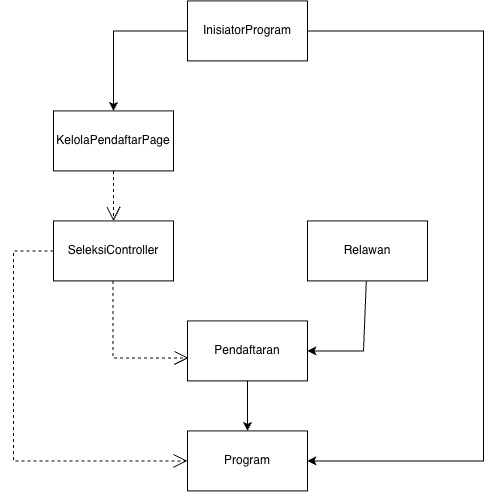
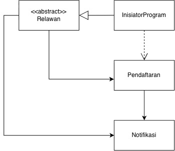
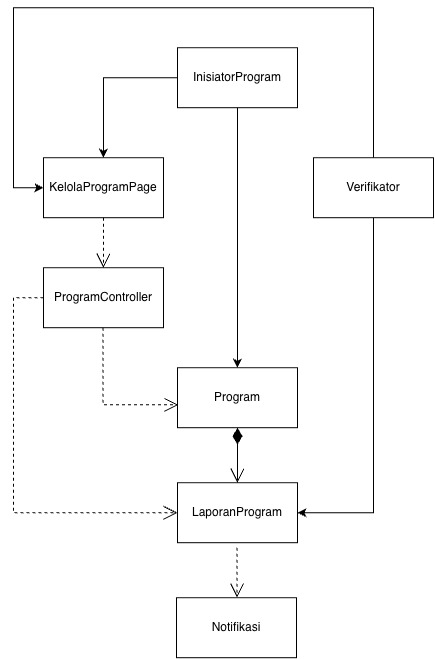
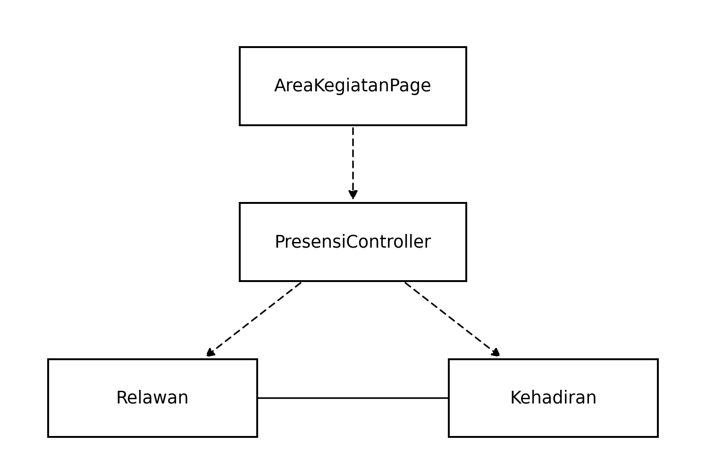
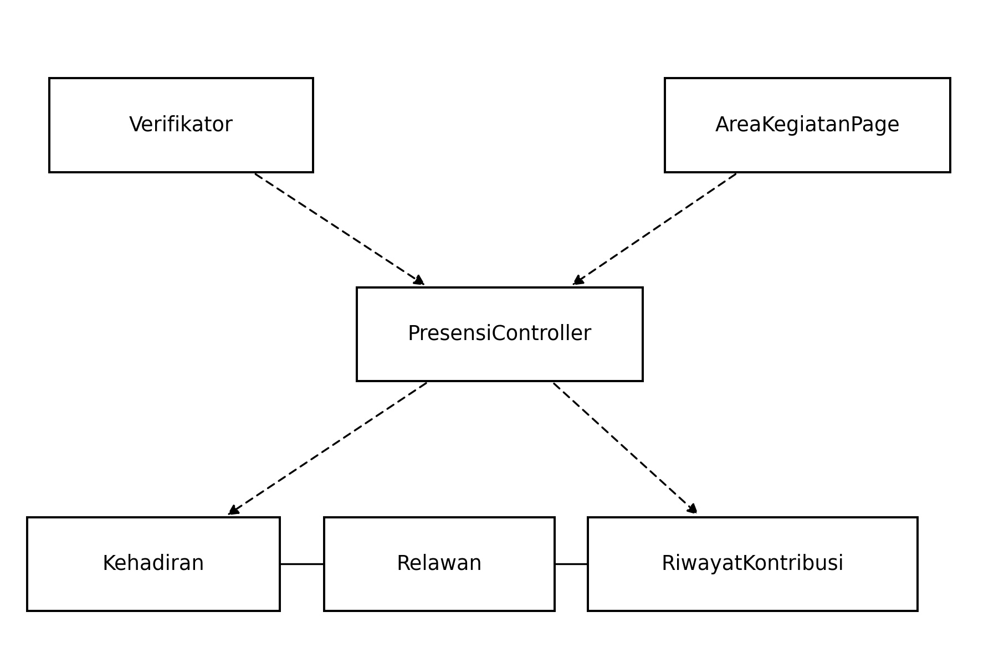

<h1>
IF2150 REKAYASA PERANGKAT LUNAK
 
TUGAS 4
 
CLASS DIAGRAM
</h1>
 

## RekanBumi

### Untuk: Stefani Angeline Oroh

Dipersiapkan oleh:
| Informasi | Keterangan |
| --- | --- |
| Kelas | K03 |
| Kelompok | G01  |

| NIM | Nama |
|---|---|
| 13525018 | Avicenna Ananda Musthafa |
| 13525045 | Ribka Kaylena Sanjaya |
| 13525063 | Kairenzo Vemil |
| 13525069 | Mulky Siraj Firizqi |
| 13525144 | Three Gie Gendhis Sekar Ayoe Jatmiko |
---

## Daftar Perubahan

| Revisi | Deskripsi |
| :--- | :--- |
| A | Merevisi diksi dari semua KF tanpa mengubah makna intinya  |
| *B* |  |
| *C* |  |
| ... |  |

 
 

# BAB 1: Deskripsi Perangkat Lunak

RekanBumi adalah platform web yang mempertemukan masyarakat umum dengan lembaga lingkungan terverifikasi untuk memfasilitasi aksi nyata lewat program "Jaga Alam" dan "Jaga Iklim". Dari sudut pandang pengguna, relawan mengekspektasikan kemudahan mencari kegiatan terstruktur yang sesuai preferensi lokasi dan waktu, sementara lembaga membutuhkan sarana untuk meningkatkan visibilitas program serta mengelola perekrutan relawan secara transparan. Alur kerja sistem berjalan mulai dari verifikasi legalitas lembaga dan kurasi program oleh Admin, dilanjutkan dengan pencarian serta pendaftaran kegiatan oleh relawan, hingga pelaksanaan lapangan dan pencatatan riwayat aksi secara otomatis. Solusi ini diharapkan dapat menjembatani tingginya kepedulian masyarakat dengan sarana kontribusi yang jelas guna mempercepat pencapaian SDG 13 dan SDG 15 di Indonesia.

> *Sistem adalah kesatuan utuh antara perangkat lunak, pengguna, perangkat keras, dan proses bisnis (urutan langkah logis yang dilakukan di dunia nyata untuk menyelesaikan suatu pekerjaan atau mencapai tujuan tertentu).*

# BAB 2: Kebutuhan Fungsional

## 2.1 Kebutuhan Fungsional

| ID KF | ID Kebutuhan | Penjelasan |
| :--- | :--- | :--- |
| KF01 | R02 | Ketika inisiator mengunggah dokumen verifikasi, perangkat lunak harus menerima dokumen melalui fitur *upload* dan *drag-and-drop*. |
| KF02 | R05 | Ketika inisiator memasukkan tautan situs web resmi lembaga, perangkat lunak harus menyimpan tautan tersebut sebagai bagian dari informasi program. |
| KF03 | R06 | Ketika pengguna melakukan pencarian program, perangkat lunak harus menerima /keyword/ melalui kolom pencarian. |
| KF04 | R07 | Ketika pengguna memilih kategori program, perangkat lunak harus menampilkan program berdasarkan kategori “Jaga Alam” atau“Jaga Iklim”. |
| KF05 | R08 | Jika kuota program telah terpenuhi, perangkat lunak harus menolak permohonan pendaftaran relawan pada program tersebut.  |
| KF06 | R09 | Sebelum calon relawan mengirimkan permohonan pendaftaran, perangkat lunak harus memastikan calon relawan telah melakukan login. |
| KF07 | R10 | Ketika calon relawan mengirimkan permohonan pendaftaran, perangkat lunak harus menyimpan catatan keterampilan atau ketersediaan waktu yang diberikan. |
| KF08 | R13 | Ketika status pendaftaran relawan berubah, perangkat lunak harus mengirimkan notifikasi kepada relawan mengenai status pendaftarannya. |
| KF09 | R14 | Ketika inisiator menentukan hasil seleksi calon relawan, perangkat lunak harus menyediakan dan menyimpan status “Diterima” atau “Ditolak” untuk setiap calon relawan. |
| KF10 | R15 |Sebelum permohonan pendaftaran dikirimkan, perangkat lunak harus memeriksa kelengkapan dan status verifikasi data diri calon relawan. |
| KF11 | R17 | Ketika relawan melakukan check-in pada suatu program, perangkat lunak harus mencatat waktu kehadiran relawan tersebut. |
| KF12 | R18 | Jika relawan telah berstatus diterima dan waktu pelaksanaan kegiatan telah sesuai dengan jadwal, perangkat lunak harus memberikan akses kepada relawan untuk melakukan check-in. |
| KF13 | R20 | Ketika inisiator mengunggah dokumentasi akhir kegiatan, perangkat lunak harus menyimpan dokumentasi tersebut dan mengubah status kegiatan menjadi selesai. |
| KF14 | R24 | Ketika status kegiatan berubah menjadi selesai, perangkat lunak harus secara otomatis mencatat dan memperbarui akumulasi jam aksi relawan. |
| KF15 | R25 | Ketika inisiator mengirimkan ringkasan capaian program, perangkat lunak harus menyimpan ringkasan capaian dampak lingkungan tersebut. |

Tabel 2.1. Daftar Kebutuhan Fungsional (telah direvisi)

---

# BAB 3: Model Use Case

## 3.1 Identifikasi Aktor
Daftarkan seluruh aktor yang terlibat dalam use case yang akan dimodelkan. Aktor berupa pengguna manusia yang berinteraksi dengan solusi. Perlu diperhatikan bahwa Admin/Developer/ Pihak Eksternal lain yang bisa diotomisasi, tidak perlu dijadikan aktor.

| Aktor | Deskripsi |
| :--- | :--- |
| Inisiator Program (Lembaga/Komunitas) | Pengguna ini bertindak sebagai lembaga atau komunitas lingkungan yang bertanggung jawab untuk membuat program aksi, menentukan kebutuhan kuota relawan, melakukan seleksi pendaftar, dan mencatat laporan kegiatan pasca program. |
| Relawan (Masyarakat Umum) | Pengguna ini bertindak sebagai individu dari masyarakat umum yang mencari kegiatan kerelawanan, mendaftarkan diri, menghadiri kegiatan di lokasi, dan menerima catatan riwayat aksi yang telah diselesaikan. |
| Verifikator (Admin Platftom) | Pengguna ini bertindak sebagai pengelola sistem RekanBumi yang bertugas untuk memverifikasi identitas dan legalitas inisiator program serta meninjau kelayakan program sebelum diterbitkan ke publik. |

## 3.2 Identifikasi Use Case

Use case berfungsi untuk mendeskripsikan interaksi aktor-aktor yang terlibat dengan sistem.
| ID UC | Nama Use Case | Deskripsi Singkat | Aktor Terlibat | ID KF Terkait |
| :--- | :--- | :--- | :--- | :--- |
| UC01 | Daftar program | Inisiator program mendaftarkan programnya ke web dan melampirkan dokumen yang diperlukan, dan relawan melampirkan dokumen yang diperlukan untuk daftar program sekaligus akun.| Inisiator Program, Relawan| KF01, KF10 |
| UC02 | *Login* akun | Relawan masuk ke akun yang telah didaftarkan sebelumnya | Relawan | KF06 |
| UC03 | Mencari program | Relawan mencari program melalui kolom pencarian atau fitur filter. | Relawan | KF03, KF04 |
| UC04 | Mengunjungi situs program | Relawan mengunjungi situs web program yang terlampir pada tiap deskripsi untuk melihat detail program. | Relawan | KF02 |
| UC05 | Menyeleksi calon relawan pendaftar | Inisiator program menyeleksi relawan yang mendaftar program.| Inisiator program | KF05, KF07 |
| UC06 | Konfirmasi status pendaftaran | Inisiator program, Relawan | Inisiator program, Relawan | KF08, KF09 |
| UC07 | Memperbarui status program | Inisiator program menyatakan status keberlangsungan program, dan verifikator mengonfirmasinya. | Inisiator program, Verifikator | KF13, KF15 |
| UC08 | Konfirmasi kehadiran program | Relawan melampirkan bukti kehadiran program yang didaftarkannya.|  Relawan | KF11, KF12 |
| UC09 | Memperbarui status akun relawan | Verifikator memperbarui status kontribusi relawan pada akunnya. | Verifikator, Relawan | KF14 |

## 3.3 Use Case Diagram
Buatlah diagram use case keseluruhan berdasarkan identifikasi use case beserta aktor yang melakukan use case tersebut. Perhatikan garis `<<extend>>` dan `<<include>>`.

Pada bagian ini, Anda diperbolehkan untuk menyalin dari dokumen sebelumnya.

 

<i>Gambar 1. Use Case Diagram</i>

 

## 3.4 Skenario Use Case

### 3.4.1 Skenario UC01

**Nama Use Case:** Daftar program

**Skenario Normal**

| No | Aksi Aktor | Reaksi Perangkat Lunak |
| :--- | :--- | :--- |
| 1 | Aktor (Inisiator Program atau Relawan) mengakses halaman pendaftaran dan mengisi formulir data | Sistem menampilkan formulir pendaftaran beserta area unggah dokumen |
| 2 | Aktor memasukkan dokumen yang diperlukan ke dalam area unggah | Sistem menerima dokumen yang diunggah melalui fitur upload dan drag-and-drop |
| 3 | Aktor menekan tombol kirim pendaftaran | Sistem memeriksa kelengkapan dan status verifikasi data, memproses pendaftaran, menyimpan data, dan menampilkan notifikasi keberhasilan |

 

**Skenario Alternatif 1: Data Diri Relawan Tidak Lengkap**

| No | Aksi Aktor | Reaksi Perangkat Lunak |
| :--- | :--- | :--- |
| 1 | Aktor (Inisiator Program atau Relawan) mengakses halaman pendaftaran dan mengisi formulir data | Sistem menampilkan formulir pendaftaran beserta area unggah dokumen |
| 2 | Aktor memasukkan dokumen yang diperlukan ke dalam area unggah | Sistem menerima dokumen yang diunggah melalui fitur upload dan drag-and-drop |
| 3 | Aktor menekan tombol kirim pendaftaran | Sistem memeriksa kelengkapan data, mendeteksi data tidak lengkap, membatalkan pengiriman, dan menampilkan pesan peringatan untuk melengkapi data |

### 3.4.2 Skenario UC02

**Nama Use Case:** Login akun

**Skenario Normal**

| No | Aksi Aktor | Reaksi Perangkat Lunak |
| :--- | :--- | :--- |
| 1 | Relawan memilih tombol pendaftaran pada halaman suatu program dalam keadaan belum masuk ke akun | Sistem mengharuskan calon relawan untuk melakukan login dan mengarahkan ke halaman login akun |
| 2 | Relawan memasukkan kredensial akun dan menekan tombol login | Sistem memverifikasi kredensial, memberikan akses masuk, dan mengarahkan relawan kembali ke halaman program |

 

**Skenario Alternatif 1: Kredensial Salah**

| No | Aksi Aktor | Reaksi Perangkat Lunak |
| :--- | :--- | :--- |
| 1 | Relawan memilih tombol pendaftaran pada halaman suatu program dalam keadaan belum masuk ke akun | Sistem mengharuskan calon relawan untuk melakukan login dan mengarahkan ke halaman login akun |
| 2 | Relawan memasukkan kredensial akun yang salah dan menekan tombol login | Sistem menolak kredensial tersebut dan menampilkan pesan gagal masuk akun |

### 3.4.3 Skenario UC03

**Nama Use Case:** Mencari program

**Skenario Normal**

| No | Aksi Aktor | Reaksi Perangkat Lunak |
| :--- | :--- | :--- |
| 1 | Relawan membuka halaman eksplorasi program | Sistem menampilkan daftar program, kolom pencarian, dan pilihan kategori Jaga Alam dan Jaga Iklim |
| 2 | Relawan mengetikkan kata kunci pada kolom pencarian dan memilih salah satu kategori program | Sistem memproses masukan, memfilter, dan menampilkan daftar program yang cocok dengan pencarian |

 

**Skenario Alternatif 1: Program Tidak Ditemukan**

| No | Aksi Aktor | Reaksi Perangkat Lunak |
| :--- | :--- | :--- |
| 1 | Relawan membuka halaman eksplorasi program | Sistem menampilkan daftar program, kolom pencarian, dan pilihan kategori Jaga Alam dan Jaga Iklim |
| 2 | Relawan mengetikkan kata kunci acak pada kolom pencarian dan memilih salah satu kategori program | Sistem memproses masukan, tidak menemukan program yang sesuai, dan menampilkan pesan bahwa program tidak ditemukan |

### 3.4.4 Skenario UC04

**Nama Use Case:** Mengunjungi situs program

**Skenario Normal**

| No | Aksi Aktor | Reaksi Perangkat Lunak |
| :--- | :--- | :--- |
| 1 | Relawan memilih salah satu program aksi untuk melihat detail informasi program | Sistem menampilkan halaman detail program yang memuat informasi lengkap beserta tautan situs web resmi lembaga |
| 2 | Relawan mengklik tautan situs web resmi lembaga yang tertera pada detail program | Sistem mengarahkan (*redirect*) relawan ke halaman situs web resmi milik lembaga terkait pada tab baru |

 

**Skenario Alternatif 1: Tautan Situs Web Tidak Disediakan**

| No | Aksi Aktor | Reaksi Perangkat Lunak |
| :--- | :--- | :--- |
| 1 | Relawan memilih salah satu program aksi untuk melihat detail informasi program | Sistem mendeteksi bahwa data tautan situs web resmi bernilai kosong (*null*) |
| 2 | Relawan meninjau halaman detail program | Sistem menonaktifkan (*disable*) elemen tautan dan menampilkan keterangan bahwa situs web resmi tidak tersedia |

### 3.4.5 Skenario UC05

**Nama Use Case:** Menyeleksi calon relawan pendaftar

**Skenario Normal**

| No | Aksi Aktor | Reaksi Perangkat Lunak |
| :--- | :--- | :--- |
| 1 | Inisiator Program membuka halaman kelola pendaftar pada suatu program | Sistem menampilkan daftar calon relawan beserta catatan keterampilan atau ketersediaan waktu yang diberikan |
| 2 | Inisiator Program menentukan pilihan status "Diterima" atau "Ditolak" untuk calon relawan | Sistem mencatat status pilihan pada antarmuka seleksi |
| 3 | Inisiator Program menekan tombol simpan hasil seleksi | Sistem menyimpan pilihan status "Diterima" dan "Ditolak" untuk setiap calon relawan dan menampilkan pesan keberhasilan |

 

**Skenario Alternatif 1: Kuota Relawan Telah Terpenuhi**

| No | Aksi Aktor | Reaksi Perangkat Lunak |
| :--- | :--- | :--- |
| 1 | Inisiator Program memilih status "Diterima" pada pendaftar baru ketika kuota relawan program sudah penuh | Sistem mendeteksi bahwa kuota relawan program telah terpenuhi |
| 2 | Inisiator Program menekan tombol simpan hasil seleksi | Sistem menolak permohonan pendaftaran relawan dan menampilkan pesan kesalahan bahwa kuota program telah terpenuhi |
| 3 | Inisiator Program mengubah status pendaftar tersebut menjadi "Ditolak" atau membatalkan pilihan | Sistem memperbarui antarmuka dan kembali ke langkah 3 Skenario Normal |

### 3.4.6 Skenario UC06

**Nama Use Case:** Konfirmasi status pendaftaran

**Skenario Normal**

| No | Aksi Aktor | Reaksi Perangkat Lunak |
| :--- | :--- | :--- |
| 1 | Inisiator Program mengonfirmasi pengiriman hasil keputusan seleksi relawan | Sistem memproses konfirmasi dan secara otomatis mengirimkan notifikasi mengenai status pendaftarannya kepada relawan |
| 2 | Relawan membuka menu notifikasi pada akunnya | Sistem menampilkan detail pemberitahuan berisi status hasil seleksi pendaftaran ("Diterima" atau "Ditolak") |

### 3.4.7 Skenario UC07

**Nama Use Case:** Memperbarui status program

**Skenario Normal**

| No | Aksi Aktor | Reaksi Perangkat Lunak |
| :--- | :--- | :--- |
| 1 | Inisiator Program membuka halaman kelola program yang sedang berlangsung dan mengunggah dokumentasi akhir kegiatan (foto lapangan) beserta catatan capaian, misalnya jumlah bibit ditanam atau sampah terkumpul | Sistem menerima dan menyimpan dokumentasi serta catatan capaian sebagai draf laporan akhir program |
| 2 | Inisiator Program menekan tombol untuk mengubah status program menjadi "Selesai" dan mengirimkan laporan untuk ditinjau | Sistem mengubah status program menjadi "Menunggu Konfirmasi" dan mengirimkan notifikasi kepada Verifikator bahwa terdapat laporan akhir yang perlu ditinjau |
| 3 | Verifikator meninjau laporan akhir program dan menekan tombol konfirmasi persetujuan | Sistem mengonfirmasi status program menjadi "Selesai", menyimpan ringkasan capaian dampak lingkungan dari program tersebut, dan menampilkannya pada halaman publik |

 

**Skenario Alternatif 1: Verifikator Menolak Laporan Akhir**

| No | Aksi Aktor | Reaksi Perangkat Lunak |
| :--- | :--- | :--- |
| 1 | Inisiator Program membuka halaman kelola program dan mengunggah dokumentasi akhir kegiatan beserta catatan capaian | Sistem menerima dan menyimpan dokumentasi serta catatan capaian sebagai draf laporan akhir program |
| 2 | Inisiator Program menekan tombol untuk mengubah status program menjadi "Selesai" dan mengirimkan laporan untuk ditinjau | Sistem mengubah status program menjadi "Menunggu Konfirmasi" dan mengirimkan notifikasi kepada Verifikator |
| 3 | Verifikator meninjau laporan dan mendapati dokumentasi atau catatan capaian tidak lengkap, lalu menekan tombol tolak beserta catatan revisi | Sistem mengembalikan status program menjadi "Perlu Revisi" dan mengirimkan notifikasi kepada Inisiator Program berisi catatan revisi yang harus dilengkapi |

### 3.4.8 Skenario UC08

**Nama Use Case:** Konfirmasi kehadiran program

**Skenario Normal**

| No | Aksi Aktor | Reaksi Perangkat Lunak |
| :--- | :--- | :--- |
| 1 | Relawan berstatus "Diterima" membuka halaman detail program pada hari pelaksanaan kegiatan dan memilih menu check-in | Sistem memeriksa status relawan dan waktu pelaksanaan kegiatan saat ini, lalu menampilkan tombol check-in karena keduanya sesuai ketentuan |
| 2 | Relawan menekan tombol check-in untuk mengonfirmasi kehadiran | Sistem mencatat waktu kehadiran relawan pada program tersebut dan menampilkan notifikasi bahwa kehadiran berhasil dikonfirmasi |

 

**Skenario Alternatif 1: Check-in di Luar Waktu Pelaksanaan**

| No | Aksi Aktor | Reaksi Perangkat Lunak |
| :--- | :--- | :--- |
| 1 | Relawan berstatus "Diterima" membuka halaman detail program di luar rentang waktu pelaksanaan kegiatan dan memilih menu check-in | Sistem memeriksa waktu pelaksanaan kegiatan, mendeteksi bahwa waktu saat ini berada di luar jadwal, dan menonaktifkan tombol check-in |
| 2 | Relawan meninjau halaman program | Sistem menampilkan keterangan bahwa fitur check-in belum/tidak dapat diakses beserta rentang waktu yang diizinkan |

### 3.4.9 Skenario UC09

**Nama Use Case:** Memperbarui status akun relawan

**Skenario Normal**

| No | Aksi Aktor | Reaksi Perangkat Lunak |
| :--- | :--- | :--- |
| 1 | Verifikator mengonfirmasi status suatu program menjadi "Selesai" | Sistem secara otomatis menghitung dan mencatat penambahan jam aksi bagi setiap relawan yang terkonfirmasi hadir pada program tersebut ke dalam profil portofolio masing-masing |
| 2 | Relawan membuka halaman profil/portofolio pada akunnya | Sistem menampilkan riwayat program yang telah diikuti beserta akumulasi jam aksi terbaru relawan tersebut |

 

**Skenario Alternatif 1: Relawan Tidak Melakukan Check-in Saat Kegiatan**

| No | Aksi Aktor | Reaksi Perangkat Lunak |
| :--- | :--- | :--- |
| 1 | Verifikator mengonfirmasi status suatu program menjadi "Selesai" | Sistem memeriksa data kehadiran tiap relawan terdaftar pada program tersebut dan mendeteksi terdapat relawan yang tidak memiliki catatan check-in |
| 2 | Relawan yang bersangkutan membuka halaman profil/portofolio pada akunnya | Sistem tidak menambahkan jam aksi untuk program tersebut pada portofolio relawan, karena kehadirannya tidak tercatat |

# BAB 4: Diagram Kelas
Bagian ini berisi identifikasi kelas dan pemodelan struktur kelas yang diperlukan untuk merealisasikan use case pada BAB 3. Gunakan skenario use case (3.4) sebagai dasar untuk menentukan kelas, atribut, metode, dan hubungan antarkelas.

## 4.1 Identifikasi Kelas
Identifikasi seluruh kelas yang diperlukan berdasarkan use case dan skenarionya. Satu kelas boleh terkait dengan lebih dari satu use case.

| ID Kelas | Nama Kelas | Deskripsi Kelas | ID Use Case |
| --- | --- | --- | --- |
| C01 | Program | Menyimpan data seperti waktu/tempat, deskripsi, kuota, syarat ketentuan, dan status. (Entity Class) | UC01, UC03, UC04, UC07 |
| C02 | Pendaftaran | Menyimpan data keterampilan, ketersediaan waktu, status pendaftaran. (Entity Class) | UC05, UC06 |
| C03 | Relawan | Menyimpan data profil relawan dan informasi kontribusi. (Entity Class) | UC01, UC02, UC05, UC06, UC08, UC09 |
| C04 | Pengguna | Kelas abstrak akun pengguna platform; secara eksklusif menyimpan data kredensial email dan kata sandi. (Entity Class) | UC01, UC02 |
| C05 | InisiatorProgram | Menyimpan data lembaga untuk mengelola program, seleksi, dan laporan. (Entity Class) | UC01, UC05, UC06, UC07 |
| C06 | Verifikator | Menyimpan data admin yang meninjau laporan akhir. (Entity Class) | UC07, UC09 |
| C07 | DokumenVerifikasi | Menyimpan dokumen yang diunggah saat registrasi beserta statusnya. (Entity Class) | UC01 |
| C08 | Kehadiran | Menyimpan catatan check-in relawan. (Entity Class) | UC08, UC09 |
| C09 | LaporanProgram | Menyimpan dokumentasi akhir, capaian, dan status peninjauan. (Entity Class) | UC07 |
| C10 | Notifikasi | Menyimpan pemberitahuan otomatis ke pengguna. (Entity Class) | UC06, UC07 |
| C11 | RiwayatKontribusi | Menyimpan jam aksi relawan per program selesai. (Entity Class) | UC09 |
| C12 | KelolaAkunPage | Menyediakan antarmuka input kredensial untuk otentikasi dan pendaftaran akun. (Boundary Class) | UC01, UC02 |
| C13 | AuthController | Memvalidasi kredensial pengguna, mengelola sesi masuk, dan pembuatan akun baru. (Controller Class) | UC01, UC02 |
| C14 | KelolaProgramPage | Menyediakan antarmuka bagi Inisiator untuk mendaftarkan program baru dan mengunggah laporan akhir. (Boundary Class) | UC01, UC07 |
| C15 | ProgramController | Mengelola validasi pembuatan, penelusuran, detail, dan pembaruan status program. (Controller Class) | UC01, UC03, UC04, UC07 |
| C16 | EksplorasiProgramPage | Menyediakan antarmuka bagi Relawan untuk mencari, menyaring, dan meninjau detail program. (Boundary Class) | UC03, UC04 |
| C17 | KelolaPendaftarPage | Menyediakan antarmuka bagi Inisiator untuk menyeleksi dan melihat status calon relawan. (Boundary Class) | UC05, UC06 |
| C18 | SeleksiController | Mengelola proses seleksi pendaftar, pengecekan kuota, dan pemicu pengiriman notifikasi. (Controller Class) | UC05, UC06 |
| C19 | AreaKegiatanPage | Menyediakan antarmuka check-in kehadiran relawan dan pembaruan portofolio. (Boundary Class) | UC08, UC09 |
| C20 | PresensiController | Mencatat data validasi kehadiran lapangan dan memperbarui riwayat jam aksi relawan. (Controller Class) | UC08, UC09 |

Pastikan setiap kelas memiliki tanggung jawab yang jelas dan memang diperlukan untuk merealisasikan fungsi yang dimodelkan. Hindari kelas yang tidak memiliki keterkaitan dengan KF atau use case manapun.

## 4.2 Diagram Kelas per Use Case
Buat diagram kelas untuk setiap use case pada 3.2.

### 4.2.1 Use Case UC01

**Nama Use Case:** Daftar Program

#### Identifikasi Kelas

| ID Kelas | Nama Kelas | Deskripsi Kelas |
| :--- | :--- | :--- |
| C01 | Program | Menyimpan data seperti waktu/tempat, deskripsi, kuota, syarat ketentuan, dan status. (Entity Class) | 
| C03 | Relawan | Menyimpan data profil relawan dan informasi kontribusi. (Entity Class) | 
| C04 | Pengguna | Kelas abstrak akun pengguna platform; secara eksklusif menyimpan data kredensial email dan kata sandi. (Entity Class) |
| C05 | InisiatorProgram | Menyimpan data lembaga untuk mengelola program, seleksi, dan laporan. (Entity Class) | 
| C07 | DokumenVerifikasi | Menyimpan dokumen yang diunggah saat registrasi beserta statusnya. (Entity Class) | 
| C12 | KelolaAkunPage | Menyediakan antarmuka input kredensial untuk otentikasi dan pendaftaran akun. (Boundary Class) |
| C13 | AuthController | Memvalidasi kredensial pengguna, mengelola sesi masuk, dan pembuatan akun baru. (Controller Class) | 
| C14 | KelolaProgramPage | Menyediakan antarmuka bagi Inisiator untuk mendaftarkan program baru dan mengunggah laporan akhir. (Boundary Class) | 
| C15 | ProgramController | Mengelola validasi pembuatan, penelusuran, detail, dan pembaruan status program. (Controller Class) | 

#### Diagram Kelas

<i>Gambar 2. Diagram Kelas Use Case UC01</i>

 

Pada diagram kelas, cukup tampilkan nama kelas saja. Atribut dan metode/operasi milik setiap kelas dapat dituliskan pada tabel di bawah ini. Pastikan hubungan antarkelas menggunakan jenis relasi yang sesuai (asosiasi, agregasi, komposisi, generalisasi, atau dependensi).

| ID Kelas | Nama Kelas | Atribut | Metode/Operasi |
| :--- | :--- | :--- | :--- |
| C01 | Program | idProgram, namaProgram, waktuPelaksanaan, tempatPelaksanaan, deskripsi, kuota, syaratKetentuan, status | perbaruiStatus(), cekKuotaTersedia() |
| C03 | Relawan | idRelawan, nama, noTelepon | tampilkanProfil() |
| C04 | Pengguna | (Entity Class)email, kataSandi | tampilkanProfil() |
| C05 | InisiatorProgram | idInisiator, namaLembaga, tautanSitusResmi | tampilkanProfilLembaga() |
| C07 | DokumenVerifikasi | idDokumen, jenisDokumen, urlFile, statusVerifikasi | perbaruiStatusVerifikasi() |
| C12 | KelolaAkunPage | - (Boundary Class) | tampilkanFormLogin(), tampilkanFormRegistrasi(), tampilkanPesanError() |
| C13 | - (Controller Class) | validasiKredensial(), buatAkunBaru(), mulaiSesi(), akhiriSesi() |
| C14 | KelolaProgramPage | - (Boundary Class) | tampilkanFormProgram(), unggahLaporanAkhir() |
| C15 | ProgramController | - (Controller Class) | validasiDataProgram(), simpanProgramBaru() |

### 4.2.2 Use Case UC02

**Nama Use Case:** Login akun

#### Identifikasi Kelas

| ID Kelas | Nama Kelas | Deskripsi Kelas |
| :--- | :--- | :--- |
| C12 | KelolaAkunPage | Menyediakan antarmuka input kredensial untuk otentikasi dan pendaftaran akun. (Boundary Class) |
| C13 | AuthController | Memvalidasi kredensial pengguna, mengelola sesi masuk, dan pembuatan akun baru. (Controller Class) |
| C04 | Pengguna | Kelas abstrak akun pengguna platform; secara eksklusif menyimpan data kredensial email dan kata sandi. (Entity Class) |
| C03 | Relawan | Menyimpan data profil relawan dan informasi kontribusi. (Entity Class) |

<i>Gambar 3. Diagram Kelas Use Case UC02</i>

 

| ID Kelas | Nama Kelas | Atribut | Metode/Operasi |
| :--- | :--- | :--- | :--- |
| C12 | KelolaAkunPage | formLogin | tampilkanFormLogin(), terimaInputKredensial(), tampilkanPesanStatus() |
| C13 | AuthController | - | verifikasiKredensial(), buatSesiMasuk() |
| C04 | Pengguna | email, kataSandi | getEmail(), getKataSandi() |
| C03 | Relawan | nama, domisili | getProfil() |

### 4.2.3 Use Case UC03

**Nama Use Case:** Mencari program

#### Identifikasi Kelas

| ID Kelas | Nama Kelas | Deskripsi Kelas |
| :--- | :--- | :--- |
| C16 | EksplorasiProgramPage | Menyediakan antarmuka bagi Relawan untuk mencari, menyaring, dan meninjau detail program. (Boundary Class) |
| C15 | ProgramController | Mengelola validasi pembuatan, penelusuran, detail, dan pembaruan status program. (Controller Class) |
| C01 | Program | Menyimpan data seperti waktu/tempat, deskripsi, kuota, syarat ketentuan, dan status. (Entity Class) |

<i>Gambar 4. Diagram Kelas Use Case UC03</i>

 

| ID Kelas | Nama Kelas | Atribut | Metode/Operasi |
| :--- | :--- | :--- | :--- |
| C16 | EksplorasiProgramPage | kataKunciPencarian, filterKategori | tampilkanDaftarProgram(), terimaInputPencarian() |
| C15 | ProgramController | - | cariProgram(), filterProgram() |
| C01 | Program | namaProgram, kategori, status | getRingkasanProgram() |

### 4.2.4 Use Case UC04

**Nama Use Case:** Mengunjungi situs program

#### Identifikasi Kelas

| ID Kelas | Nama Kelas | Deskripsi Kelas |
| :--- | :--- | :--- |
| C16 | EksplorasiProgramPage | Menyediakan antarmuka bagi Relawan untuk mencari, menyaring, dan meninjau detail program. (Boundary Class) |
| C15 | ProgramController | Mengelola validasi pembuatan, penelusuran, detail, dan pembaruan status program. (Controller Class) |
| C01 | Program | Menyimpan data seperti waktu/tempat, deskripsi, kuota, syarat ketentuan, dan status. (Entity Class) |

<i>Gambar 5. Diagram Kelas Use Case UC04</i>

 

| ID Kelas | Nama Kelas | Atribut | Metode/Operasi |
| :--- | :--- | :--- | :--- |
| C16 | EksplorasiProgramPage | idProgramTerpilih | tampilkanDetailProgram(), arahkanKeSitusResmi(), nonaktifkanTautan() |
| C15 | ProgramController | - | ambilDetailProgram(), validasiTautanSitus() |
| C01 | Program | tautanSitusResmi, deskripsi | getTautan(), getDetail() |

### 4.2.5 Use Case UC05

**Nama Use Case:** Menyeleksi calon relawan pendaftar 

#### Identifikasi Kelas

| ID Kelas | Nama Kelas | Deskripsi Kelas |
| :--- | :--- | :--- |
| C01 | Program | Menyimpan data kuota dan status program; digunakan untuk memeriksa apakah kuota relawan masih tersedia sebelum permohonan diterima. (Entity Class) |
| C02 | Pendaftaran | Menyimpan data keterampilan, ketersediaan waktu, status pendaftaran yang menjadi penghubung relawan dengan program. (Entity Class) |
| C03 | Relawan | Menyimpan data relawan, termasuk informasi akun yang diperlukan untuk login serta informasi terkait kontribusi dan pendaftaran program. (Entity Class) |
| C05 | InisiatorProgram | Menyimpan data lembaga/komunitas pembuat program (nama lembaga, tautan situs resmi) serta menjadi pengelola program, seleksi pendaftar, dan laporan akhir. (Entity Class) |
| C17 | KelolaPendaftarPage | Menyediakan antarmuka bagi Inisiator untuk menyeleksi dan melihat status calon relawan. (Boundary Class) |
| C18 | SeleksiController | Mengelola proses seleksi pendaftar, pengecekan kuota, dan pemicu pengiriman notifikasi. (Controller Class) |

#### Diagram Kelas

 

<i>Gambar 6. Diagram Kelas Use Case UC05</i>

 

| ID Kelas | Nama Kelas | Atribut | Metode/Operasi |
| :--- | :--- | :--- | :--- |
| C01 | Program | keterampilan, ketersediaanWaktu, status | cekKuota() |
| C02 | Pendaftaran | keterampilan, ketersediaanWaktu, status | daftar() |
| C03 | Relawan | noTelepon, statusVerifikasi, totalJamAksi | simpanDataDiri(), editDataDiri(). lihatDataDiri() | 
| C05 | InisiatorProgram | namaLembaga, tautanSitusResmi, statusVerifikasi | lihatDaftarRelawan(), ubahStatusProgram(), simpanHasilSeleksi() |
| C17 | KelolaPendaftarPage | - | tampilkanDaftarPendaftar(), tampilkanFormSeleksi() | 
| C18 | SeleksiController | - | validasiKuota(), simpanHasilSeleksi() |

### 4.2.6 Use Case UC06

**Nama Use Case:** Konfirmasi status pendaftaran

#### Identifikasi Kelas

| ID Kelas | Nama Kelas | Deskripsi Kelas |
| :--- | :--- | :--- |
| C02 | Pendaftaran | Menyimpan data keterampilan, ketersediaan waktu, status pendaftaran yang menjadi penghubung relawan dengan program. (Entity Class) |
| C03 | Relawan | Menyimpan data relawan, termasuk informasi akun yang diperlukan untuk login serta informasi terkait kontribusi dan pendaftaran program. (Entity Class) |
| C05 | InisiatorProgram | Menyimpan data lembaga/komunitas pembuat program (nama lembaga, tautan situs resmi) serta menjadi pengelola program, seleksi pendaftar, dan laporan akhir (Entity Class) |
| C10 | Notifikasi | Menyimpan pemberitahuan otomatis kepada pengguna (hasil seleksi ke relawan, laporan akhir ke verifikator, catatan revisi ke inisiator) beserta status dibacanya. (Entity Class) |
| C17 | KelolaPendaftarPage | 	Menyediakan antarmuka bagi Inisiator untuk mengonfirmasi hasil seleksi pendaftar. (Boundary Class) |
| C18 | SeleksiController | Mengelola proses konfirmasi status pendaftaran dan pemicu pengiriman notifikasi. (Controller Class) |

#### Diagram Kelas

<i>Gambar 7. Diagram Kelas Use Case UC06</i>

 

| ID Kelas | Nama Kelas | Atribut | Metode/Operasi |
| :--- | :--- | :--- | :--- |
| C02 | Pendaftaran | keterampilan, ketersediaanWaktu, status | updateStatus(), triggerNotifikasi() | 
| C03 | Relawan | noTelepon, statusVerifikasi, totalJamAksi | lihatNotifikasi() | 
| C05 | InisiatorProgram | namaLembaga, tautanSitusResmi, statusVerifikasi | konfirmasiHasilSeleksi() | 
| C10 | Notifikasi | pesan, waktuKirim, statusDibaca | buatNotifikasi(), kirim(), baca(), showDetail() | 
| C17 | KelolaPendaftarPage | - | tampilkanKonfirmasiHasil() |
| C18 | SeleksiController | - | triggerNotifikasi() |

### 4.2.7 Use Case UC07

**Nama Use Case:** Memperbarui status program

#### Identifikasi Kelas

| ID Kelas | Nama Kelas | Deskripsi Kelas |
| :--- | :--- | :--- |
| C01 | Program |  Menyimpan data seperti waktu/tempat pelaksanaan, deskripsi, kuota, syarat ketentuan, dan status. (Entity Class) |
| C05 | InisiatorProgram | Menyimpan data lembaga/komunitas pembuat program (nama lembaga, tautan situs resmi) serta menjadi pengelola program, seleksi pendaftar, dan laporan akhir. (Entity Class) |
| C06 | Verifikator | Menyimpan data pengelola platform yang meninau dan mengonfirmasi laporan akhir program, sehingga memicu pembaruan status kontribusi relawan. (Entity Class) |
| C09 | LaporanProgram | LaporanProgram | Menyimpan dokumentasi akhir, catatan capaian, ringkasan dampak lingkungan, status peninjauan, dan catatan revisi dari verifikator. (Entity Class) | 
| C10 | Notifikasi | Menyimpan pemberitahuan otomatis kepada pengguna (hasil seleksi ke relawan, laporan akhir ke verifikator, catatan revisi ke inisiator) beserta status dibacanya. (Entity Class) |
| C14 | KelolaProgramPage | Menyediakan antarmuka bagi Inisiator untuk mengunggah laporan akhir kegiatan. (Boundary Class) | 
| C15 | ProgramController | Mengelola validasi dan pembaruan status program berdasarkan laporan akhir. (Controller Class) | 

#### Diagram Kelas

<i>Gambar 8. Diagram Kelas Use Case UC07</i>

 

| ID Kelas | Nama Kelas | Atribut | Metode/Operasi |
| :--- | :--- | :--- | :--- |
| C01 | Program | namaProgram, deskripsi, kategori, lokasi, jadwal, kuota, status, syaratKetentuan | updateStatus(), showSummary(), showDokumentasi()| 
| C05 | InisiatorProgram | namaLembaga, tautanSitusResmi, statusVerifikasi | uploadDokumentasi(), simpanStatus() |
| C06 | Verifikator | - | tinjauLaporan(), konfirmasiLaporan(), tolakLaporan() | 
| C09 | LaporanProgram | dokumentasiAkhir, catatanCapaian, simpanRingkasanDampak, catatanRevisi | simpan(), setujui(), tolak() | 
| C10 | Notifikasi | pesan, waktuKirim, statusDibaca | buatNotifikasi(), kirim(), baca(), showDetail() | 
| C14 | KelolaProgramPage | - | tampilkanFormLaporan(), tampilkanStatusProgram() | 
| C15 | ProgramController | - | updateStatusProgram(), validasiLaporan() | 

### 4.2.8 Use Case UC08

**Nama Use Case:** Konfirmasi kehadiran program

#### Identifikasi Kelas

| ID Kelas | Nama Kelas | Deskripsi Kelas |
| :--- | :--- | :--- |
| C03 | Relawan |  Menyimpan data relawan yang telah berstatus diterima pada suatu program, digunakan untuk memvalidasi identitas dan kelayakan relawan saat melakukan check-in. (Entity Class) |
| C08 | Kehadiran | Menyimpan catatan check-in relawan pada suatu program, termasuk waktu kehadiran yang tercatat begitu proses konfirmasi berhasil dilakukan. (Entity Class) |
| C19 | AreaKegiatanPage | Menyediakan antarmuka bagi relawan untuk mengakses menu check-in dan menampilkan status ketersediaan fitur tersebut sesuai jadwal kegiatan. (Boundary Class) |
| C20 | PresensiController | Memvalidasi status relawan dan kesesuaian waktu pelaksanaan kegiatan sebelum mengizinkan check-in, serta mencatat data kehadiran ke Kehadiran. (Controller Class) | 

#### Diagram Kelas

<i>Gambar 9. Diagram Kelas Use Case UC08</i>

 

| ID Kelas | Nama Kelas | Atribut | Metode/Operasi |
| :--- | :--- | :--- | :--- |
| C03 | Relawan |  noTelepon, statusVerifikasi, totalJamAksi | cekStatusKelayakan() |
| C08 | Kehadiran | idKehadiran, waktuKehadiran | catatKehadiran() |
| C19 | AreaKegiatanPage | - | tampilkanTombolCheckIn(), tampilkanStatusCheckIn() |
| C20 | PresensiController | - | validasiStatusRelawan(), validasiWaktuPelaksanaan(), prosesCheckIn() | 

### 4.2.9 Use Case UC09

**Nama Use Case:** Memperbarui status akun relawanm

#### Identifikasi Kelas

| ID Kelas | Nama Kelas | Deskripsi Kelas |
| :--- | :--- | :--- |
| C03 | Relawan |  Menyimpan data relawan yang menerima pembaruan akumulasi jam aksi serta menampilkan riwayat kontribusinya pada halaman portofolio. (Entity Class) |
| C06 | Verifikator | Menyimpan data admin platform yang mengonfirmasi status penyelesaian program, sehingga memicu pembaruan otomatis pada portofolio relawan terkait. (Entity Class) |
| C08 | Kehadiran | Menyimpan catatan check-in relawan pada suatu program, digunakan sistem untuk menentukan relawan mana saja yang berhak menerima pembaruan jam aksi. (Entity Class) |
| C11 | RiwayatKontribusi | Menyimpan akumulasi jam aksi dan daftar program yang telah diselesaikan oleh setiap relawan sebagai bagian dari portofolio dampaknya. (Entity Class) | 
| C19 | AreaKegiatanPage | Menyediakan antarmuka bagi relawan untuk melihat halaman profil/portofolio berisi riwayat program dan akumulasi jam aksi terbaru. (Boundary Class) |
| C20 | PresensiController | Memproses pembaruan otomatis akumulasi jam aksi relawan berdasarkan data kehadiran begitu status program dikonfirmasi selesai oleh Verifikator. (Controller Class) | 

#### Diagram Kelas

<i>Gambar 10. Diagram Kelas Use Case UC09</i>

 

| ID Kelas | Nama Kelas | Atribut | Metode/Operasi |
| :--- | :--- | :--- | :--- |
| C03 | Relawan |  noTelepon, statusVerifikasi, totalJamAksi | lihatPortofolio() |
| C06 | Verifikator | - | konfirmasiPenyelesaianProgram() |
| C08 | Kehadiran | idKehadiran, waktuKehadiran | cekKehadiran() |
| C11 | RiwayatKontribusi | idRiwayat, totalJamAksi, daftarProgramSelesai | perbaruiJamAksi(), tambahRiwayatProgram() |
| C19 | AreaKegiatanPage | - | tampilkanPortofolio(), tampilkanRiwayatProgram() |
| C20 | PresensiController | - | 	hitungJamAksi(), perbaruiPortofolioRelawan() |

## 4.3 Diagram Kelas Keseluruhan

<i>Gambar 11. Diagram Kelas Keseluruhan</i>

 

| ID Kelas | Nama Kelas | Atribut | Metode/Operasi |
| :--- | :--- | :--- | :--- |
| C01 | Program | idProgram, namaProgram, waktuPelaksanaan, tempatPelaksanaan, deskripsi, kuota, syaratKetentuan, status, kategori, tautanSitusResmi, keterampilan, ketersediaanWaktu, lokasi, jadwal | perbaruiStatus(), cekKuotaTersedia(), getRingkasanProgram(), getTautan(), getDetail(), cekKuota(), updateStatus(), showSummary(), showDokumentasi() |
| C02 | Pendaftaran | keterampilan, ketersediaanWaktu, status | daftar(), updateStatus(), triggerNotifikasi() |
| C03 | Relawan | idRelawan, nama, noTelepon, domisili, statusVerifikasi, totalJamAksi | tampilkanProfil(), getProfil(), simpanDataDiri(), editDataDiri(), lihatDataDiri(), lihatNotifikasi(), cekStatusKelayakan(), lihatPortofolio() |
| C04 | Pengguna | email, kataSandi | tampilkanProfil(), getEmail(), getKataSandi() |
| C05 | InisiatorProgram | idInisiator, namaLembaga, tautanSitusResmi, statusVerifikasi | tampilkanProfilLembaga(), lihatDaftarRelawan(), ubahStatusProgram(), simpanHasilSeleksi(), konfirmasiHasilSeleksi(), uploadDokumentasi(), simpanStatus() |
| C06 | Verifikator | - | tinjauLaporan(), konfirmasiLaporan(), tolakLaporan(), konfirmasiPenyelesaianProgram() |
| C07 | DokumenVerifikasi | idDokumen, jenisDokumen, urlFile, statusVerifikasi | perbaruiStatusVerifikasi() |
| C08 | Kehadiran | idKehadiran, waktuKehadiran | catatKehadiran(), cekKehadiran() |
| C09 | LaporanProgram | dokumentasiAkhir, catatanCapaian, simpanRingkasanDampak, catatanRevisi | simpan(), setujui(), tolak() |
| C10 | Notifikasi | pesan, waktuKirim, statusDibaca | buatNotifikasi(), kirim(), baca(), showDetail() |
| C11 | RiwayatKontribusi | idRiwayat, totalJamAksi, daftarProgramSelesai | perbaruiJamAksi(), tambahRiwayatProgram() |
| C12 | KelolaAkunPage | formLogin | tampilkanFormLogin(), tampilkanFormRegistrasi(), tampilkanPesanError(), terimaInputKredensial(), tampilkanPesanStatus() |
| C13 | AuthController | - | validasiKredensial(), buatAkunBaru(), mulaiSesi(), akhiriSesi(), verifikasiKredensial(), buatSesiMasuk() |
| C14 | KelolaProgramPage | - | tampilkanFormProgram(), unggahLaporanAkhir(), tampilkanFormLaporan(), tampilkanStatusProgram() |
| C15 | ProgramController | - | validasiDataProgram(), simpanProgramBaru(), cariProgram(), filterProgram(), ambilDetailProgram(), validasiTautanSitus(), updateStatusProgram(), validasiLaporan() |
| C16 | EksplorasiProgramPage | kataKunciPencarian, filterKategori, idProgramTerpilih | tampilkanDaftarProgram(), terimaInputPencarian(), tampilkanDetailProgram(), arahkanKeSitusResmi(), nonaktifkanTautan() |
| C17 | KelolaPendaftarPage | - | tampilkanDaftarPendaftar(), tampilkanFormSeleksi(), tampilkanKonfirmasiHasil() |
| C18 | SeleksiController | - | validasiKuota(), simpanHasilSeleksi(), triggerNotifikasi() |
| C19 | AreaKegiatanPage | - | tampilkanTombolCheckIn(), tampilkanStatusCheckIn(), tampilkanPortofolio(), tampilkanRiwayatProgram() |
| C20 | PresensiController | - | validasiStatusRelawan(), validasiWaktuPelaksanaan(), prosesCheckIn(), hitungJamAksi(), perbaruiPortofolioRelawan() |

---

# BAB 5: Traceability
Cocokkan setiap kebutuhan fungsional, use case, dengan diagram kelas yang mendukung atau mengimplementasikan kebutuhan tersebut.

| ID Kelas | ID Use Case | ID KF |
| :--- | :--- | :--- |
| C01 | UC01, UC03, UC04, UC07 | KF02, KF04, KF05, KF13, KF15 |
| C02 | UC05, UC06 | KF07, KF09 |
| C03 | UC01, UC02, UC05, UC06, UC08, UC09 | KF10, KF12, KF14 |
| C04 | UC01, UC02 | KF06 |
| C05 | UC01, UC05, UC06, UC07 | KF02, KF13 |
| C06 | UC07, UC09 | KF13, KF14 |
| C07 | UC01 | KF01 |
| C08 | UC08, UC09 | KF11, KF14 |
| C09 | UC07 | KF13, KF15 |
| C10 | UC06, UC07 | KF08 |
| C11 | UC09 | KF14 |
| C12 | UC01, UC02 | KF01, KF06 |
| C13 | UC01, UC02 | KF06, KF10 |
| C14 | UC01, UC07 | KF13 |
| C15 | UC01, UC03, UC04, UC07 | KF02, KF03, KF04, KF13 |
| C16 | UC03, UC04 | KF02, KF03, KF04 |
| C17 | UC05, UC06 | KF05, KF07, KF09 |
| C18 | UC05, UC06 | KF05, KF08, KF09 |
| C19 | UC08, UC09 | KF11, KF12 |
| C20 | UC08, UC09 | KF11, KF12, KF14 |

---

# Referensi

- Diagram UML: [https://www.drawio.com/](https://www.drawio.com/), [https://staruml.io/](https://staruml.io/)
