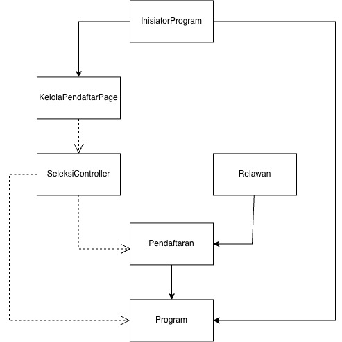
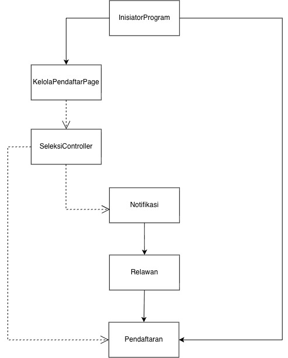
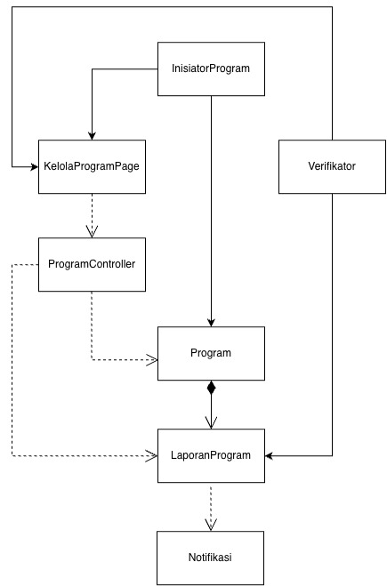
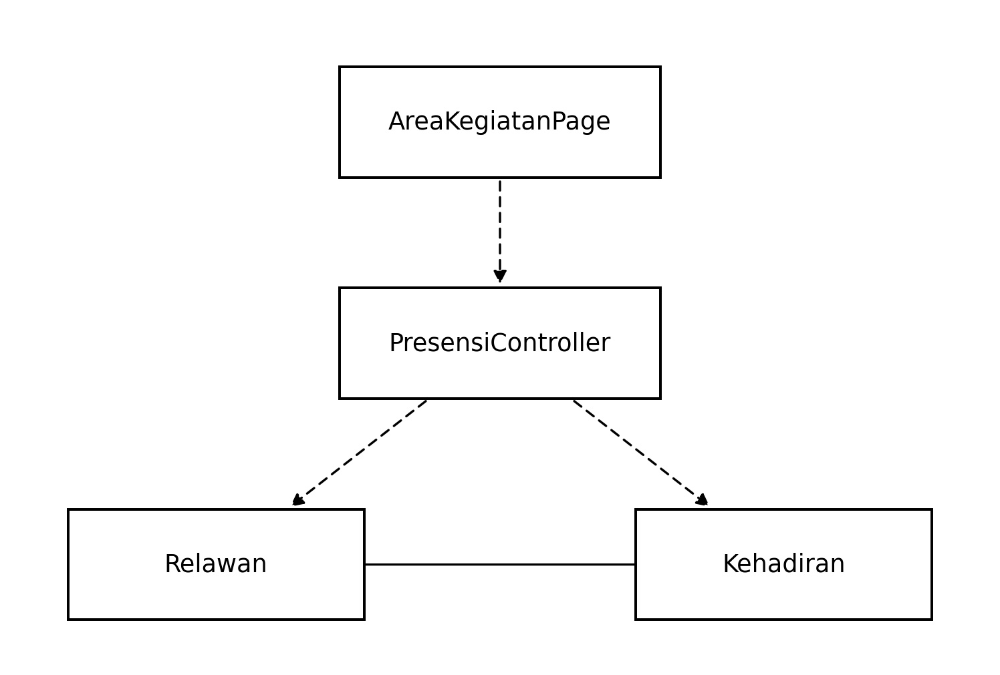
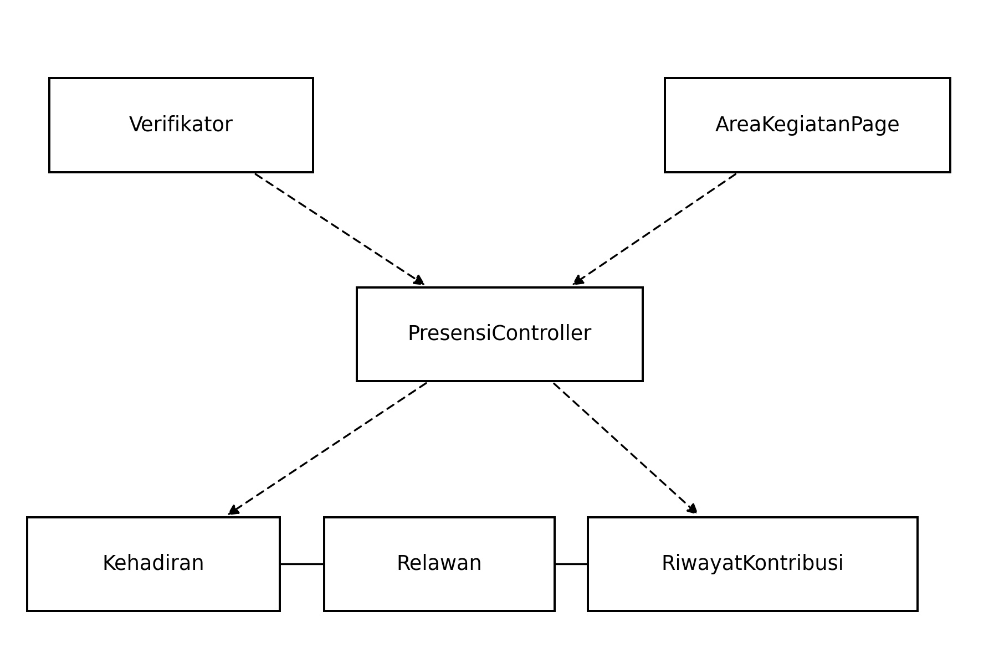

<h1>
IF2150 REKAYASA PERANGKAT LUNAK
 
TUGAS 5
 
SPESIFIKASI KEBUTUHAN PERANGKAT LUNAK (SKPL)
</h1>
 

## RekanBumi

### Untuk: Stefani Angeline Oroh

Dipersiapkan oleh:
| Informasi | Keterangan |
| --- | --- |
| Kelas | K03 |
| Kelompok | G01  |

| NIM | Nama |
|---|---|
| 13525018 | Avicenna Ananda Musthafa |
| 13525045 | Ribka Kaylena Sanjaya |
| 13525063 | Kairenzo Vemil |
| 13525069 | Mulky Siraj Firizqi |
| 13525144 | Three Gie Gendhis Sekar Ayoe Jatmiko |
---

## Daftar Perubahan

| Revisi | Deskripsi |
| :--- | :--- |
| A | Penyesuaian format 4.4.6 4.4.7 4.4.9 |
| *B* |  |
| *C* |  |
| ... |  |

 

# BAB 1: Pendahuluan

## 1.1 Tujuan Penulisan Dokumen
Dokumen Spesifikasi Kebutuhan Perangkat Lunak (SKPL) ini disusun untuk mendefinisikan secara rinci kebutuhan fungsional dan non-fungsional dari perangkat lunak RekanBumi, mencakup kebutuhan pengguna, batasan sistem, lingkungan operasi, model use case, serta model kelas yang menjadi acuan dalam tahap perancangan dan pengembangan perangkat lunak selanjutnya. Dokumen ini disusun agar seluruh pihak yang terlibat memiliki pemahaman yang sama dan jelas mengenai fungsi serta batasan sistem yang akan dibangun, sehingga dapat meminimalkan kesalahpahaman antara pengembang dan pengguna kebutuhan selama proses pengembangan berlangsung.

Dokumen ini ditujukan untuk beberapa pihak, yaitu:

1. Tim pengembang (developer) RekanBumi, sebagai acuan dalam melakukan implementasi, pengujian, dan pemeliharaan perangkat lunak agar sesuai dengan kebutuhan yang telah disepakati.
2. Asisten dan dosen mata kuliah IF2150 Rekayasa Perangkat Lunak, sebagai bahan evaluasi terhadap kesesuaian rancangan kebutuhan perangkat lunak yang diajukan oleh kelompok.
3. Pihak-pihak yang berkepentingan lain (calon Inisiator Program, Relawan, dan Verifikator), sebagai gambaran umum mengenai fungsi dan batasan layanan yang akan disediakan oleh RekanBumi.

## 1.2 Lingkup Masalah

RekanBumi adalah suatu web terintegrasi yang berperan sebagai perantara atau penghubung antara masyarakat umum yang berperan sebagai relawan untuk program-program ramah lingkungan yang disediakan oleh lembaga-lembaga yang tersebar di seluruh Indonesia. Web ini dikembangkan atas dasar *awareness* dalam mewujudkan aksi nyata dalam menjaga iklim dan ekosistem darat yang tercantum pada SDG 13 dan SDG 15. RekanBumi diharapkan dapat mempersempit kesenjangan antara besarnya potensi partisipasi masyarakat dengan minimnya sarana yang menghubungkan mereka dengan lembaga-lembaga lingkungan yang membutuhkan dukungan.

## 1.3 Definisi, Istilah, dan Singkatan

Tabel 1.3. Definisi Istilah dan Singkatan

| Singkatan, Akronim, atau Istilah | Penjelasan |
| :--- | :--- |
| P/L | Singkatan dari Perangkat Lunak, yaitu aplikasi yang memberikan perintah kepada komputer untuk menjalankan tugas tertentu. |
| SKPL | Singkatan dari Spesifikasi Kebutuhan Perangkat Lunak, yaitu dokumen yang merangkum kriteria-kriteria yang diperlukan untuk membangun aplikasi menjalankan tugasnya.* |
| KF | Singkatan dari Kebutuhan Fungsional. |
| KNF | Singkatan dari Kebutuhan Non-Fungsional. |
| UC | Singkatan dari *Use Case*. |
| EARS | Singkatan dari *Easy Approach to Requirements Syntax*, yaitu pola penulisan kebutuhan agar konsisten dan mudah diuji. |
| SDG | Singkatan dari *Sustainable Development Goals* atau Tujuan Pembangunan Keberlanjutan berupa 17 tujuan yang disepakati PBB untuk mencapai perdamaian dan kemakmuran manusia dan bumi tahun 2030. |
| Inisiator Program | Lembaga atau komunitas lingkungan yang mendaftarkan diri dan programnya pada web RekanBumi, lalu mengelola program, seleksi relawan, dan laporan kegiatan. |
| Relawan | Masyarakat umum yang memiliki akun pribadi di RekanBumi dan mendaftar, mengikuti, atau berkontribusi pada setidaknya satu program. |
| Verifikator | Admin platform RekanBumi yang memverifikasi identitas dan legalitas Inisiator Program serta meninjau kelayakan program dan laporan akhir sebelum dipublikasikan. |
| Program | Kegiatan ramah lingkungan yang diinisiasi oleh Inisiator Program dan terdaftar pada web RekanBumi, merupakan setidaknya salah satu dari dua kategori 'Jaga Alam' dan 'Jaga Iklim'. |
| Jaga Alam | Kategori program yang tersedia pada web RekanBumi yang meliputi program-program penjagaan kebersihan lingkungan dan kesejahteraan hewan liar. |
| Jaga Iklim | Kategori program yang tersedia pada web RekanBumi yang meliputi program-program penanaman pohon. |

## 1.4 Aturan Penomoran
Seluruh komponen kebutuhan dan elemen pemodelan dalam dokumen SKPL ini diidentifikasi menggunakan pola penomoran (*ID prefix*) untuk menjaga konsistensi dan memudahkan penelusuran (*traceability*). Aturan penomoran yang digunakan disajikan pada Tabel 1.4.

Tabel 1.4. Aturan Penomoran Dokumen SKPL

| Hal/Bagian | Penomoran | Keterangan |
| :--- | :--- | :--- |
| Kebutuhan Fungsional | KFXX | Identifikasi unik untuk setiap fungsi dan respons utama perangkat lunak (KF01–KF15). |
| Kebutuhan Non-Fungsional | KNFXX | Identifikasi unik untuk batasan kualitas, performa, dan keandalan sistem (KNF01–KNF08). |
| Aktor | AXX | Identifikasi entitas pengguna atau peran yang berinteraksi dengan sistem (A01–A03). |
| Use Case | UCXX | Identifikasi unit interaksi fungsional antara aktor dan perangkat lunak (UC01–UC09). |
| Kelas | CXX | Identifikasi entitas kelas pada pemodelan berorientasi objek (C01–C20). |

## 1.5 Referensi
1. Next.js Documentation. https://nextjs.org/docs
2. Tailwind CSS Documentation. https://tailwindcss.com/docs
3. Prisma Documentation. https://www.prisma.io/docs
4. tRPC Documentation. https://trpc.io/docs
5. Better Auth Documentation. https://www.better-auth.com/docs
6. Neon Documentation. https://neon.tech/docs
7. Diagram UML: https://www.drawio.com/
8. 8. Rukmono, S. A. Apa yang Harus Ada di Dalam Dokumen SRS/SKPL? Menurut SWEBOK v4 (Slide presentasi). IF2150 Rekayasa Perangkat Lunak

## 1.6 Deskripsi Umum Dokumen (Ikhtisar)
Dokumen ini disusun dengan sistematika sebagai berikut:

1. BAB 1 Pendahuluan berisi tujuan penulisan dokumen, lingkup masalah yang diselesaikan oleh RekanBumi, definisi istilah dan singkatan yang digunakan, aturan penomoran identifikasi (ID) pada dokumen, referensi yang digunakan, serta ikhtisar/sistematika dokumen ini.
2. BAB 2 Deskripsi Perangkat Lunak berisi deskripsi umum sistem beserta activity diagram proses bisnis, deskripsi umum perangkat lunak, daftar pengguna beserta kebutuhannya, batasan perangkat lunak, dan lingkungan operasi yang dibutuhkan.
3. BAB 3 Deskripsi Kebutuhan Perangkat Lunak berisi daftar Kebutuhan Fungsional (KF) dalam format EARS dan Kebutuhan Non-Fungsional (KNF) beserta parameternya.
4. BAB 4 Pemodelan Use Case berisi identifikasi aktor, identifikasi use case, use case diagram, serta skenario use case (normal dan alternatif) untuk setiap use case yang telah diidentifikasi.
5. BAB 5 Pemodelan Kelas berisi identifikasi kelas, diagram kelas untuk setiap use case beserta atribut dan metode/operasinya, serta diagram kelas keseluruhan yang menggabungkan seluruh kelas pada sistem.
6. BAB 6 Traceability berisi keterkaitan antara Kebutuhan Fungsional, Use Case, dan Kelas yang saling mendukung satu sama lain.

---

# BAB 2: Deskripsi Perangkat Lunak

## 2.1 Deskripsi Umum Sistem
Bagian ini dapat disalin dari BAB 1.1 *Deskripsi Umum Sistem* pada dokumen *Requirement Gathering*, disesuaikan bila ada perubahan alur bisnis. Lengkapi dengan gambaran proses bisnis dalam bentuk *Activity Diagram* (boleh disalin dan diperbarui dari 3.3 *Model Proses Bisnis* pada dokumen *Topic Brainstorming*).

RekanBumi adalah platform web yang mempertemukan masyarakat umum dengan lembaga lingkungan terverifikasi untuk memfasilitasi aksi nyata lewat program "Jaga Alam" dan "Jaga Iklim". Dari sudut pandang pengguna, relawan mengekspektasikan kemudahan mencari kegiatan terstruktur yang sesuai preferensi lokasi dan waktu, sementara lembaga membutuhkan sarana untuk meningkatkan visibilitas program serta mengelola perekrutan relawan secara transparan. Alur kerja sistem berjalan mulai dari verifikasi legalitas lembaga dan kurasi program oleh verifikator, dilanjutkan dengan pencarian serta pendaftaran kegiatan oleh relawan, hingga pelaksanaan lapangan dan pencatatan riwayat aksi secara otomatis. Solusi ini diharapkan dapat menjembatani tingginya kepedulian masyarakat dengan sarana kontribusi yang jelas guna mempercepat pencapaian SDG 13 dan SDG 15 di Indonesia.

<i>Gambar 1. Activity Diagram Alur Pendaftaran & Verifikasi Inisiator</i>

 

<i>Gambar 2. Activity Diagram Alur Manajemen & Publikasi Program</i>

 

<i>Gambar 3. Activity Diagram Alur Eksplorasi & Rekrutmen Relawan</i>

 

<i>Gambar 4. Activity Diagram Alur Eksekusi & Pelaporan Kegiatan</i>

## 2.2 Deskripsi Umum Perangkat Lunak
RekanBumi merupakan perangkat lunak berbasis web (*web application*) yang dirancang untuk mendukung ekosistem kerelawanan lingkungan berbasis aksi nyata guna mempercepat pencapaian SDG 13 dan SDG 15 di Indonesia. Perangkat lunak ini bertindak sebagai platform terintegrasi yang menghubungkan tiga aktor utama, yaitu **Relawan** (masyarakat umum), **Inisiator Program** (lembaga/komunitas lingkungan), dan **Verifikator** (admin platform).

Lingkup fungsionalitas perangkat lunak mencakup pengelolaan seluruh siklus kegiatan kerelawanan secara terstruktur. Alur kerja sistem meliputi manajemen otentikasi akun, pendaftaran dan verifikasi legalitas lembaga inisiator, publikasi dan pencarian program aksi ("Jaga Alam" dan "Jaga Iklim"), seleksi pendaftar relawan berdasarkan kriteria kuota, konfirmasi presensi kehadiran di lokasi kegiatan, hingga pembaruan otomatis akumulasi jam aksi ke dalam portofolio kontribusi relawan.

Dalam menjalankan operasinya untuk mendukung proses bisnis tersebut, perangkat lunak RekanBumi berinteraksi dengan beberapa antarmuka dan layanan eksternal:
1. **Situs Web Resmi Inisiator (Sistem Eksternal):** Perangkat lunak menyimpan tautan situs resmi milik lembaga inisiator dan menyediakan akses pengalihan (*redirect*) antarmuka bagi relawan untuk meninjau detail legalitas atau profil lembaga eksternal pada tab peramban web baru.
2. **Layanan Penyimpanan Berkas (*Cloud File Storage*):** Perangkat lunak berinteraksi dengan antarmuka unggah berkas (*upload & drag-and-drop*) untuk menerima, memvalidasi format, serta menyimpan berkas dokumen verifikasi legalitas lembaga dan foto dokumentasi akhir kegiatan.
3. **Sistem Notifikasi Internal:** Perangkat lunak mengelola alur pemicu notifikasi otomatis berbasis kejadian (*event-driven*) untuk menginformasikan perubahan status pendaftaran relawan, status peninjauan laporan program, serta catatan revisi dari verifikator.

## 2.3 Pengguna dan Kebutuhan Pengguna Perangkat Lunak
Tuliskan seluruh jenis pengguna (*role*/aktor) yang terlibat dalam perangkat lunak (P/L), beserta kebutuhannya secara umum. Bagian ini dapat disalin dari 1.2 *Deskripsi Pengguna Perangkat Lunak* (dokumen Requirement Gathering) atau 3.1 *Identifikasi Aktor* (dokumen Use Case), pastikan sudah konsisten dengan aktor final yang dipakai di BAB 4.

| Aktor | Deskripsi |
| :--- | :--- |
| Inisiator Program (Lembaga/Komunitas) | Pengguna ini bertindak sebagai lembaga atau komunitas lingkungan yang bertanggung jawab untuk membuat program aksi, menentukan kebutuhan kuota relawan, melakukan seleksi pendaftar, dan mencatat laporan kegiatan pasca program. |
| Relawan (Masyarakat Umum) | Pengguna ini bertindak sebagai individu dari masyarakat umum yang mencari kegiatan kerelawanan, mendaftarkan diri, menghadiri kegiatan di lokasi, dan menerima catatan riwayat aksi yang telah diselesaikan. |
| Verifikator (Admin Platftom) | Pengguna ini bertindak sebagai pengelola sistem RekanBumi yang bertugas untuk memverifikasi identitas dan legalitas inisiator program serta meninjau kelayakan program sebelum diterbitkan ke publik. |

## 2.4 Batasan Perangkat Lunak
Batasan yang harus dituliskan, di antaranya:
Perangkat lunak RekanBumi memiliki batasan sebagai berikut:

1. RekanBumi merupakan perangkat lunak berbasis web sehingga pengguna mengakses perangkat lunak melalui peramban web.
2. RekanBumi membutuhkan koneksi internet agar pengguna dapat mengakses layanan perangkat lunak.
3. RekanBumi dapat dioperasikan melalui peramban web modern pada perangkat desktop dan mobile, yaitu Google Chrome, Microsoft Edge, Mozilla Firefox, dan Apple Safari.
4. RekanBumi menggunakan tautan situs web resmi yang diberikan oleh Inisiator Program untuk mengarahkan pengguna ke situs eksternal. Ketersediaan dan isi situs eksternal berada di luar lingkup RekanBumi.

## 2.5 Lingkungan Operasi Perangkat Lunak
Spesifikasi *operating system* atau lingkungan yang dibutuhkan P/L untuk beroperasi. Bagian ini digunakan untuk memastikan pengguna memiliki spesifikasi yang cukup untuk menjalankan P/L. Misalnya mencakup komponen server, client, OS, DBMS, tetapi tidak menutupi kemungkinan komponen lain.

| Komponen | Spesifikasi |
| :--- | :--- |
| Server | Node.js 20+|
| Client | Web browser modern pada perangkat desktop dan mobile |
| DBMS | Neon PostgreSQL |
| OS | Cross-platform melalui web browser pada perangkat desktop dan mobile |
| Frontend | Next.js 15 dan Tailwind CSS |
| Authentication | Better Auth |
| ORM | Prisma |
| API | tRPC |
---

# BAB 3: Deskripsi Kebutuhan Perangkat Lunak

## 3.1 Kebutuhan Fungsional (KF)
Salin ulang **seluruh Kebutuhan Fungsional (KF)** versi terbaru dari BAB 2.1 dokumen *Class Diagram* (sudah versi final dan sudah memakai format EARS). Pastikan ID Kebutuhan (kolom "ID Kebutuhan") juga konsisten dengan ID pada tabel Pemetaan Kebutuhan di dokumen *Requirement Gathering*.

Tabel 3.1. Kebutuhan Fungsional

| ID KF | ID Kebutuhan | Penjelasan |
| :--- | :--- | :--- |
| KF01 | R02 | Ketika inisiator mengunggah dokumen verifikasi, perangkat lunak harus menerima dokumen melalui fitur *upload* dan *drag-and-drop*. |
| KF02 | R05 | Ketika inisiator memasukkan tautan situs web resmi lembaga, perangkat lunak harus menyimpan tautan tersebut sebagai bagian dari informasi program. |
| KF03 | R06 | Ketika relawan melakukan pencarian program, perangkat lunak harus menerima /keyword/ melalui kolom pencarian. |
| KF04 | R07 | Ketika relawan memilih kategori program, perangkat lunak harus menampilkan program berdasarkan kategori “Jaga Alam” atau“Jaga Iklim”. |
| KF05 | R08 | Jika kuota program telah terpenuhi, perangkat lunak harus menolak permohonan pendaftaran relawan pada program tersebut.  |
| KF06 | R09 | Sebelum relawan mengirimkan permohonan pendaftaran, perangkat lunak harus memastikan calon relawan telah melakukan login. |
| KF07 | R10 | Ketika relawan mengirimkan permohonan pendaftaran, perangkat lunak harus menyimpan catatan keterampilan atau ketersediaan waktu yang diberikan. |
| KF08 | R13 | Ketika status pendaftaran relawan berubah, perangkat lunak harus mengirimkan notifikasi kepada relawan mengenai status pendaftarannya. |
| KF09 | R14 | Ketika inisiator menentukan hasil seleksi relawan, perangkat lunak harus menyediakan dan menyimpan status “Diterima” atau “Ditolak” untuk setiap calon relawan. |
| KF10 | R15 |Sebelum permohonan pendaftaran dikirimkan, perangkat lunak harus memeriksa kelengkapan dan status verifikasi data diri relawan. |
| KF11 | R17 | Ketika relawan melakukan check-in pada suatu program, perangkat lunak harus mencatat waktu kehadiran relawan tersebut. |
| KF12 | R18 | Jika relawan telah berstatus diterima dan waktu pelaksanaan kegiatan telah sesuai dengan jadwal, perangkat lunak harus memberikan akses kepada relawan untuk melakukan check-in. |
| KF13 | R20 | Ketika inisiator mengunggah dokumentasi akhir kegiatan, perangkat lunak harus menyimpan dokumentasi tersebut dan mengubah status kegiatan menjadi selesai. |
| KF14 | R24 | Ketika status kegiatan berubah menjadi selesai, perangkat lunak harus secara otomatis mencatat dan memperbarui akumulasi jam aksi relawan. |
| KF15 | R25 | Ketika inisiator mengirimkan ringkasan capaian program, perangkat lunak harus menyimpan ringkasan capaian dampak lingkungan tersebut. |

## 3.2 Kebutuhan Non-Fungsional (KNF)
Salin ulang Kebutuhan Non-Fungsional dari BAB 2.5 dokumen *Requirement Gathering*, sesuaikan ID Kebutuhan (kolom "ID Kebutuhan") apabila terjadi perubahan penomoran pada BAB 3.1 di atas.

Tabel 3.2. Kebutuhan Non-Fungsional

| ID KNF | ID Kebutuhan | Parameter | Deskripsi Kebutuhan |
| :--- | :--- | :--- | :--- |
| KNF01 | R06 | Performance efficiency | Ketika pengguna menggunakan fitur mesin pencarian pada beban 50 pengguna bersamaan, sistem harus menampilkan daftar hasil pencarian dalam waktu kurang dari atau sama dengan 2 detik. |
| KNF02 | R09 | Security | Ketika pengguna membuat akun, sistem harus melakukan hashing pada kata sandi menggunakan algoritma bcrypt sebelum menyimpannya ke database. |
| KNF03 | R02 | Performance efficiency | Ketika lembaga inisiator mengunggah dokumen legalitas dengan ukuran maksimal 2 MB, sistem harus menyimpan berkas tersebut dalam waktu kurang dari atau sama dengan 5 detik. |
| KNF04 | R17 | Reliability | Ketika sistem memproses beban 50 permintaan konfirmasi kehadiran secara bersamaan, sistem harus menyelesaikannya dengan jumlah kegagalan respons (seperti koneksi terputus atau galat dari server) maksimal 5 persen dari total permintaan. |
| KNF05 | R06, R17 | Compatibility | Selama pengguna mengakses platform, sistem harus menampilkan antarmuka secara utuh tanpa elemen yang terpotong pada layar desktop dengan resolusi 1024 piksel dan layar ponsel dengan resolusi 360 piksel. |
| KNF06 | R09 | Security | Bila pengguna gagal memasukkan kata sandi sebanyak 5 kali berturut-turut pada halaman masuk (login), maka sistem harus menolak permintaan masuk selanjutnya dari alamat IP tersebut selama 5 menit. |
| KNF07 | R06, R09, R17 | Interaction capability | Selama pengguna membuka halaman antarmuka web, sistem harus mendapatkan skor aksesibilitas (tingkat kemudahan antarmuka untuk dibaca dan dinavigasi) minimal 90 dari 100 ketika diuji menggunakan tool pengujian bawaan perangkat seperti Google Lighthouse. |
| KNF08 | R06, R09, R17 | Flexibility | Selama pengguna menjalankan aplikasi, sistem harus dapat memuat seluruh fungsi interaktif tanpa memunculkan pesan galat sistem (teks merah atau error pada menu developer console) pada minimal 3 peramban web modern (Google Chrome, Mozilla Firefox, dan Apple Safari). |

*Silakan pilih parameter yang relevan dengan P/L kalian (Availability, Reliability, Ergonomy, Portability, Memory, Response time, Safety, Security, dsb), tidak perlu semua parameter diisi. Lihat kembali dokumen Requirement Gathering untuk penjelasan tiap parameter.*

---

# BAB 4: Pemodelan Use Case

## 4.1 Identifikasi Aktor

Tabel 4.1. Daftar Identifikasi Aktor

| ID Aktor | Aktor | Deskripsi |
| :--- | :--- | :--- |
| A01 | Inisiator Program (Lembaga/Komunitas) | Pengguna ini bertindak sebagai lembaga atau komunitas lingkungan yang bertanggung jawab untuk membuat program aksi, menentukan kebutuhan kuota relawan, melakukan seleksi pendaftar, dan mencatat laporan kegiatan pasca program. |
| A02 | Relawan (Masyarakat Umum) | Pengguna ini bertindak sebagai individu dari masyarakat umum yang mencari kegiatan kerelawanan, mendaftarkan diri, menghadiri kegiatan di lokasi, dan menerima catatan riwayat aksi yang telah diselesaikan. |
| A03 | Verifikator (Admin Platform) | Pengguna ini bertindak sebagai pengelola sistem RekanBumi yang bertugas untuk memverifikasi identitas dan legalitas inisiator program serta meninjau kelayakan program sebelum diterbitkan ke publik. |

## 4.2 Identifikasi Use Case
Salin ulang daftar Use Case versi terbaru dari BAB 3.2 dokumen *Class Diagram*, pastikan seluruh ID KF yang dirujuk sudah sesuai dengan tabel pada 3.1.

| ID UC | Nama Use Case | Deskripsi Singkat | Aktor Terlibat | ID KF Terkait |
| :--- | :--- | :--- | :--- | :--- |
| UC01 | Daftar program | Inisiator program mendaftarkan programnya ke web dan melampirkan dokumen yang diperlukan, dan relawan melampirkan dokumen yang diperlukan untuk daftar program sekaligus akun.| Inisiator Program, Relawan| KF01, KF10 |
| UC02 | *Login* akun | Relawan masuk ke akun yang telah didaftarkan sebelumnya | Relawan | KF06 |
| UC03 | Mencari program | Relawan mencari program melalui kolom pencarian atau fitur filter. | Relawan | KF03, KF04 |
| UC04 | Mengunjungi situs program | Relawan mengunjungi situs web program yang terlampir pada tiap deskripsi untuk melihat detail program. | Relawan | KF02 |
| UC05 | Menyeleksi calon relawan pendaftar | Inisiator program menyeleksi relawan yang mendaftar program.| Inisiator program | KF05, KF07 |
| UC06 | Konfirmasi status pendaftaran | Inisiator mengonfirmasi hasil seleksi dan relawan menerima notifikasinya | Inisiator program, Relawan | KF08, KF09 |
| UC07 | Memperbarui status program | Inisiator program menyatakan status keberlangsungan program, dan verifikator mengonfirmasinya. | Inisiator program, Verifikator | KF13, KF15 |
| UC08 | Konfirmasi kehadiran program | Relawan melampirkan bukti kehadiran program yang didaftarkannya.|  Relawan | KF11, KF12 |
| UC09 | Memperbarui status akun relawan | Verifikator memperbarui status kontribusi relawan pada akunnya. | Verifikator, Relawan | KF14 |

## 4.3 Use Case Diagram
Salin ulang Use Case Diagram dari BAB 3.3 dokumen *Use Case & Scenario Use Case* atau *Class Diagram* (gunakan versi paling akhir/terbaru apabila terdapat perubahan).

<i>Gambar 5. Use Case Diagram</i>

## 4.4 Skenario Use Case
Salin ulang skenario **setiap** use case (skenario normal dan alternatif) dari BAB 3.4 dokumen *Use Case & Scenario Use Case*, sesuaikan dengan daftar UC final pada 4.2. Jika use case melibatkan lebih dari satu aktor manusia yang benar-benar berinteraksi langsung (misalnya *Kasir* yang memverifikasi transaksi setelah *Pelanggan* membayar), tambahkan kolom aksi tersendiri untuk aktor tersebut di samping kolom "Reaksi Perangkat Lunak". Sistem eksternal otomatis seperti *payment gateway* **bukan aktor**, sehingga interaksinya cukup dituliskan sebagai bagian dari "Reaksi Perangkat Lunak", bukan kolom aktor terpisah.

### 4.4.1 Skenario UC01

**Nama Use Case:** Daftar program

**Skenario Normal**

| No | Aksi Aktor | Reaksi Perangkat Lunak |
| :--- | :--- | :--- |
| 1 | Aktor (Inisiator Program atau Relawan) mengakses halaman pendaftaran dan mengisi formulir data | Sistem menampilkan formulir pendaftaran beserta area unggah dokumen |
| 2 | Aktor memasukkan dokumen yang diperlukan ke dalam area unggah | Sistem menerima dokumen yang diunggah melalui fitur upload dan drag-and-drop |
| 3 | Aktor menekan tombol kirim pendaftaran | Sistem memeriksa kelengkapan dan status verifikasi data, memproses pendaftaran, menyimpan data, dan menampilkan notifikasi keberhasilan |

 

**Skenario Alternatif 1: Data Diri Relawan Tidak Lengkap**

| No | Aksi Aktor | Reaksi Perangkat Lunak |
| :--- | :--- | :--- |
| 1 | Aktor (Inisiator Program atau Relawan) mengakses halaman pendaftaran dan mengisi formulir data | Sistem menampilkan formulir pendaftaran beserta area unggah dokumen |
| 2 | Aktor memasukkan dokumen yang diperlukan ke dalam area unggah | Sistem menerima dokumen yang diunggah melalui fitur upload dan drag-and-drop |
| 3 | Aktor menekan tombol kirim pendaftaran | Sistem memeriksa kelengkapan data, mendeteksi data tidak lengkap, membatalkan pengiriman, dan menampilkan pesan peringatan untuk melengkapi data |

### 4.4.2 Skenario UC02

**Nama Use Case:** Login akun

**Skenario Normal**

| No | Aksi Aktor | Reaksi Perangkat Lunak |
| :--- | :--- | :--- |
| 1 | Relawan memilih tombol pendaftaran pada halaman suatu program dalam keadaan belum masuk ke akun | Sistem mengharuskan calon relawan untuk melakukan login dan mengarahkan ke halaman login akun |
| 2 | Relawan memasukkan kredensial akun dan menekan tombol login | Sistem memverifikasi kredensial, memberikan akses masuk, dan mengarahkan relawan kembali ke halaman program |

 

**Skenario Alternatif 1: Kredensial Salah**

| No | Aksi Aktor | Reaksi Perangkat Lunak |
| :--- | :--- | :--- |
| 1 | Relawan memilih tombol pendaftaran pada halaman suatu program dalam keadaan belum masuk ke akun | Sistem mengharuskan calon relawan untuk melakukan login dan mengarahkan ke halaman login akun |
| 2 | Relawan memasukkan kredensial akun yang salah dan menekan tombol login | Sistem menolak kredensial tersebut dan menampilkan pesan gagal masuk akun |

### 4.4.3 Skenario UC03

**Nama Use Case:** Mencari program

**Skenario Normal**

| No | Aksi Aktor | Reaksi Perangkat Lunak |
| :--- | :--- | :--- |
| 1 | Relawan membuka halaman eksplorasi program | Sistem menampilkan daftar program, kolom pencarian, dan pilihan kategori Jaga Alam dan Jaga Iklim |
| 2 | Relawan mengetikkan kata kunci pada kolom pencarian dan memilih salah satu kategori program | Sistem memproses masukan, memfilter, dan menampilkan daftar program yang cocok dengan pencarian |

 

**Skenario Alternatif 1: Program Tidak Ditemukan**

| No | Aksi Aktor | Reaksi Perangkat Lunak |
| :--- | :--- | :--- |
| 1 | Relawan membuka halaman eksplorasi program | Sistem menampilkan daftar program, kolom pencarian, dan pilihan kategori Jaga Alam dan Jaga Iklim |
| 2 | Relawan mengetikkan kata kunci acak pada kolom pencarian dan memilih salah satu kategori program | Sistem memproses masukan, tidak menemukan program yang sesuai, dan menampilkan pesan bahwa program tidak ditemukan |

### 4.4.4 Skenario UC04

**Nama Use Case:** Mengunjungi situs program

**Skenario Normal**

| No | Aksi Aktor | Reaksi Perangkat Lunak |
| :--- | :--- | :--- |
| 1 | Relawan memilih salah satu program aksi untuk melihat detail informasi program | Sistem menampilkan halaman detail program yang memuat informasi lengkap beserta tautan situs web resmi lembaga |
| 2 | Relawan mengklik tautan situs web resmi lembaga yang tertera pada detail program | Sistem mengarahkan (*redirect*) relawan ke halaman situs web resmi milik lembaga terkait pada tab baru |

 

**Skenario Alternatif 1: Tautan Situs Web Tidak Disediakan**

| No | Aksi Aktor | Reaksi Perangkat Lunak |
| :--- | :--- | :--- |
| 1 | Relawan memilih salah satu program aksi untuk melihat detail informasi program | Sistem mendeteksi bahwa data tautan situs web resmi bernilai kosong (*null*) |
| 2 | Relawan meninjau halaman detail program | Sistem menonaktifkan (*disable*) elemen tautan dan menampilkan keterangan bahwa situs web resmi tidak tersedia |

### 4.4.5 Skenario UC05

**Nama Use Case:** Menyeleksi calon relawan pendaftar

**Skenario Normal**

| No | Aksi Aktor | Reaksi Perangkat Lunak |
| :--- | :--- | :--- |
| 1 | Inisiator Program membuka halaman kelola pendaftar pada suatu program | Sistem menampilkan daftar calon relawan beserta catatan keterampilan atau ketersediaan waktu yang diberikan |
| 2 | Inisiator Program menentukan pilihan status "Diterima" atau "Ditolak" untuk calon relawan | Sistem mencatat status pilihan pada antarmuka seleksi |
| 3 | Inisiator Program menekan tombol simpan hasil seleksi | Sistem menyimpan pilihan status "Diterima" dan "Ditolak" untuk setiap calon relawan dan menampilkan pesan keberhasilan |

 

**Skenario Alternatif 1: Kuota Relawan Telah Terpenuhi**

| No | Aksi Aktor | Reaksi Perangkat Lunak |
| :--- | :--- | :--- |
| 1 | Inisiator Program memilih status "Diterima" pada pendaftar baru ketika kuota relawan program sudah penuh | Sistem mendeteksi bahwa kuota relawan program telah terpenuhi |
| 2 | Inisiator Program menekan tombol simpan hasil seleksi | Sistem menolak permohonan pendaftaran relawan dan menampilkan pesan kesalahan bahwa kuota program telah terpenuhi |
| 3 | Inisiator Program mengubah status pendaftar tersebut menjadi "Ditolak" atau membatalkan pilihan | Sistem memperbarui antarmuka dan kembali ke langkah 3 Skenario Normal |

### 4.4.6 Skenario UC06

**Nama Use Case:** Konfirmasi status pendaftaran

**Skenario Normal**

| No | Aksi Inisiator Program | Aksi Relawan | Reaksi Perangkat Lunak |
| :--- | :--- | :--- | :--- |
| 1 | Inisiator Program mengonfirmasi pengiriman hasil keputusan seleksi relawan | - | Sistem memproses konfirmasi dan secara otomatis mengirimkan notifikasi mengenai status pendaftaran kepada relawan |
| 2 | - | Relawan membuka menu notifikasi pada akunnya | Sistem menampilkan detail pemberitahuan berisi status hasil seleksi pendaftaran ("Diterima" atau "Ditolak") |

### 4.4.7 Skenario UC07

**Nama Use Case:** Memperbarui status program

**Skenario Normal**

| No | Aksi Inisiator Program | Aksi Verifikator | Reaksi Perangkat Lunak |
| :--- | :--- | :--- | :--- |
| 1 | Inisiator Program membuka halaman kelola program yang sedang berlangsung dan mengunggah dokumentasi akhir kegiatan (foto lapangan) beserta catatan capaian, misalnya jumlah bibit ditanam atau sampah terkumpul | - | Sistem menerima dan menyimpan dokumentasi serta catatan capaian sebagai draf laporan akhir program |
| 2 | Inisiator Program menekan tombol untuk mengubah status program menjadi "Selesai" dan mengirimkan laporan untuk ditinjau | - | Sistem mengubah status program menjadi "Menunggu Konfirmasi" dan mengirimkan notifikasi kepada Verifikator bahwa terdapat laporan akhir yang perlu ditinjau |
| 3 | - | Verifikator meninjau laporan akhir program dan menekan tombol konfirmasi persetujuan | Sistem mengonfirmasi status program menjadi "Selesai", menyimpan ringkasan capaian dampak lingkungan dari program tersebut, dan menampilkannya pada halaman publik |

 

**Skenario Alternatif 1: Verifikator Menolak Laporan Akhir**

| No | Aksi Inisiator Program | Aksi Verifikator | Reaksi Perangkat Lunak |
| :--- | :--- | :--- | :--- |
| 1 | Inisiator Program membuka halaman kelola program dan mengunggah dokumentasi akhir kegiatan beserta catatan capaian | - | Sistem menerima dan menyimpan dokumentasi serta catatan capaian sebagai draf laporan akhir program |
| 2 | Inisiator Program menekan tombol untuk mengubah status program menjadi "Selesai" dan mengirimkan laporan untuk ditinjau | - | Sistem mengubah status program menjadi "Menunggu Konfirmasi" dan mengirimkan notifikasi kepada Verifikator |
| 3 | - | Verifikator meninjau laporan dan mendapati dokumentasi atau catatan capaian tidak lengkap, lalu menekan tombol tolak beserta catatan revisi | Sistem mengembalikan status program menjadi "Perlu Revisi" dan mengirimkan notifikasi kepada Inisiator Program berisi catatan revisi yang harus dilengkapi |

### 4.4.8 Skenario UC08

**Nama Use Case:** Konfirmasi kehadiran program

**Skenario Normal**

| No | Aksi Aktor | Reaksi Perangkat Lunak |
| :--- | :--- | :--- |
| 1 | Relawan berstatus "Diterima" membuka halaman detail program pada hari pelaksanaan kegiatan dan memilih menu check-in | Sistem memeriksa status relawan dan waktu pelaksanaan kegiatan saat ini, lalu menampilkan tombol check-in karena keduanya sesuai ketentuan |
| 2 | Relawan menekan tombol check-in untuk mengonfirmasi kehadiran | Sistem mencatat waktu kehadiran relawan pada program tersebut dan menampilkan notifikasi bahwa kehadiran berhasil dikonfirmasi |

 

**Skenario Alternatif 1: Check-in di Luar Waktu Pelaksanaan**

| No | Aksi Aktor | Reaksi Perangkat Lunak |
| :--- | :--- | :--- |
| 1 | Relawan berstatus "Diterima" membuka halaman detail program di luar rentang waktu pelaksanaan kegiatan dan memilih menu check-in | Sistem memeriksa waktu pelaksanaan kegiatan, mendeteksi bahwa waktu saat ini berada di luar jadwal, dan menonaktifkan tombol check-in |
| 2 | Relawan meninjau halaman program | Sistem menampilkan keterangan bahwa fitur check-in belum/tidak dapat diakses beserta rentang waktu yang diizinkan |

### 4.4.9 Skenario UC09

**Nama Use Case:** Memperbarui status akun relawan

**Skenario Normal**

| No | Aksi Verifikator | Aksi Relawan | Reaksi Perangkat Lunak |
| :--- | :--- | :--- | :--- |
| 1 | Verifikator mengonfirmasi status suatu program menjadi "Selesai" | - | Sistem secara otomatis menghitung dan mencatat penambahan jam aksi bagi setiap relawan yang terkonfirmasi hadir pada program tersebut ke dalam profil portofolio masing-masing |
| 2 | - | Relawan membuka halaman profil/portofolio pada akunnya | Sistem menampilkan riwayat program yang telah diikuti beserta akumulasi jam aksi terbaru relawan tersebut |

 

**Skenario Alternatif 1: Relawan Tidak Melakukan Check-in Saat Kegiatan**

| No | Aksi Verifikator | Aksi Relawan | Reaksi Perangkat Lunak |
| :--- | :--- | :--- | :--- |
| 1 | Verifikator mengonfirmasi status suatu program menjadi "Selesai" | - | Sistem memeriksa data kehadiran tiap relawan terdaftar pada program tersebut dan mendeteksi terdapat relawan yang tidak memiliki catatan check-in |
| 2 | - | Relawan yang bersangkutan membuka halaman profil/portofolio pada akunnya | Sistem tidak menambahkan jam aksi untuk program tersebut pada portofolio relawan, karena kehadirannya tidak tercatat |

---

# BAB 5: Pemodelan Kelas

## 5.1 Identifikasi Kelas
Salin ulang seluruh kelas yang telah diidentifikasi dari BAB 4.1 dokumen *Class Diagram*.

| ID Kelas | Nama Kelas | Deskripsi Kelas | ID Use Case |
| --- | --- | --- | --- |
| C01 | Program | Menyimpan data seperti waktu/tempat, deskripsi, kuota, syarat ketentuan, dan status. (Entity Class) | UC01, UC03, UC04, UC07 |
| C02 | Pendaftaran | Menyimpan data keterampilan, ketersediaan waktu, status pendaftaran. (Entity Class) | UC05, UC06 |
| C03 | Relawan | Menyimpan data profil relawan dan informasi kontribusi. (Entity Class) | UC01, UC02, UC05, UC06, UC08, UC09 |
| C04 | Pengguna | Kelas abstrak akun pengguna platform; secara eksklusif menyimpan data kredensial email dan kata sandi. (Entity Class) | UC01, UC02 |
| C05 | InisiatorProgram | Menyimpan data lembaga untuk mengelola program, seleksi, dan laporan. (Entity Class) | UC01, UC05, UC06, UC07 |
| C06 | Verifikator | Menyimpan data Verifikator yang meninjau laporan akhir. (Entity Class) | UC07, UC09 |
| C07 | DokumenVerifikasi | Menyimpan dokumen yang diunggah saat registrasi beserta statusnya. (Entity Class) | UC01 |
| C08 | Kehadiran | Menyimpan catatan check-in relawan. (Entity Class) | UC08, UC09 |
| C09 | LaporanProgram | Menyimpan dokumentasi akhir, capaian, dan status peninjauan. (Entity Class) | UC07 |
| C10 | Notifikasi | Menyimpan pemberitahuan otomatis ke pengguna. (Entity Class) | UC06, UC07 |
| C11 | RiwayatKontribusi | Menyimpan jam aksi relawan per program selesai. (Entity Class) | UC09 |
| C12 | KelolaAkunPage | Menyediakan antarmuka input kredensial untuk otentikasi dan pendaftaran akun. (Boundary Class) | UC01, UC02 |
| C13 | AuthController | Memvalidasi kredensial pengguna, mengelola sesi masuk, dan pembuatan akun baru. (Controller Class) | UC01, UC02 |
| C14 | KelolaProgramPage | Menyediakan antarmuka bagi Inisiator untuk mendaftarkan program baru dan mengunggah laporan akhir. (Boundary Class) | UC01, UC07 |
| C15 | ProgramController | Mengelola validasi pembuatan, penelusuran, detail, dan pembaruan status program. (Controller Class) | UC01, UC03, UC04, UC07 |
| C16 | EksplorasiProgramPage | Menyediakan antarmuka bagi Relawan untuk mencari, menyaring, dan meninjau detail program. (Boundary Class) | UC03, UC04 |
| C17 | KelolaPendaftarPage | Menyediakan antarmuka bagi Inisiator untuk menyeleksi dan melihat status calon relawan. (Boundary Class) | UC05, UC06 |
| C18 | SeleksiController | Mengelola proses seleksi pendaftar, pengecekan kuota, dan pemicu pengiriman notifikasi. (Controller Class) | UC05, UC06 |
| C19 | AreaKegiatanPage | Menyediakan antarmuka check-in kehadiran relawan dan pembaruan portofolio. (Boundary Class) | UC08, UC09 |
| C20 | PresensiController | Mencatat data validasi kehadiran lapangan dan memperbarui riwayat jam aksi relawan. (Controller Class) | UC08, UC09 |

## 5.2 Diagram Kelas per Use Case
Salin ulang diagram kelas untuk setiap use case dari BAB 4.2 dokumen *Class Diagram*, lengkap dengan tabel atribut dan metode/operasinya.

### 5.2.1 Use Case UC01

**Nama Use Case:** Daftar Program

<i>Gambar 2. Diagram Kelas Use Case UC01</i>

 

| ID Kelas | Nama Kelas | Atribut | Metode/Operasi |
| :--- | :--- | :--- | :--- |
| C01 | Program | idProgram, namaProgram, waktuPelaksanaan, tempatPelaksanaan, deskripsi, kuota, syaratKetentuan, status | perbaruiStatus(), cekKuotaTersedia() |
| C03 | Relawan | idRelawan, nama, noTelepon | tampilkanProfil() |
| C04 | Pengguna | (Entity Class)email, kataSandi | tampilkanProfil() |
| C05 | InisiatorProgram | idInisiator, namaLembaga, tautanSitusResmi | tampilkanProfilLembaga() |
| C07 | DokumenVerifikasi | idDokumen, jenisDokumen, urlFile, statusVerifikasi | perbaruiStatusVerifikasi() |
| C12 | KelolaAkunPage | - (Boundary Class) | tampilkanFormLogin(), tampilkanFormRegistrasi(), tampilkanPesanError() |
| C13 | - (Controller Class) | validasiKredensial(), buatAkunBaru(), mulaiSesi(), akhiriSesi() |
| C14 | KelolaProgramPage | - (Boundary Class) | tampilkanFormProgram(), unggahLaporanAkhir() |
| C15 | ProgramController | - (Controller Class) | validasiDataProgram(), simpanProgramBaru() |

### 5.2.2 Use Case UC02

**Nama Use Case:** Login akun

<i>Gambar 3. Diagram Kelas Use Case UC02</i>

 

| ID Kelas | Nama Kelas | Atribut | Metode/Operasi |
| :--- | :--- | :--- | :--- |
| C12 | KelolaAkunPage | formLogin | tampilkanFormLogin(), terimaInputKredensial(), tampilkanPesanStatus() |
| C13 | AuthController | - | verifikasiKredensial(), buatSesiMasuk() |
| C04 | Pengguna | email, kataSandi | getEmail(), getKataSandi() |
| C03 | Relawan | nama, domisili | getProfil() |

### 5.2.3 Use Case UC03

**Nama Use Case:** Mencari program

<i>Gambar 4. Diagram Kelas Use Case UC03</i>

 

| ID Kelas | Nama Kelas | Atribut | Metode/Operasi |
| :--- | :--- | :--- | :--- |
| C16 | EksplorasiProgramPage | kataKunciPencarian, filterKategori | tampilkanDaftarProgram(), terimaInputPencarian() |
| C15 | ProgramController | - | cariProgram(), filterProgram() |
| C01 | Program | namaProgram, kategori, status | getRingkasanProgram() |

### 5.2.4 Use Case UC04

**Nama Use Case:** Mengunjungi situs program

<i>Gambar 5. Diagram Kelas Use Case UC04</i>

 

| ID Kelas | Nama Kelas | Atribut | Metode/Operasi |
| :--- | :--- | :--- | :--- |
| C16 | EksplorasiProgramPage | idProgramTerpilih | tampilkanDetailProgram(), arahkanKeSitusResmi(), nonaktifkanTautan() |
| C15 | ProgramController | - | ambilDetailProgram(), validasiTautanSitus() |
| C01 | Program | tautanSitusResmi, deskripsi | getTautan(), getDetail() |

### 5.2.5 Use Case UC05

**Nama Use Case:** Menyeleksi calon relawan pendaftar 

 

<i>Gambar 6. Diagram Kelas Use Case UC05</i>

 

| ID Kelas | Nama Kelas | Atribut | Metode/Operasi |
| :--- | :--- | :--- | :--- |
| C01 | Program | keterampilan, ketersediaanWaktu, status | cekKuota() |
| C02 | Pendaftaran | keterampilan, ketersediaanWaktu, status | daftar() |
| C03 | Relawan | noTelepon, statusVerifikasi, totalJamAksi | simpanDataDiri(), editDataDiri(). lihatDataDiri() | 
| C05 | InisiatorProgram | namaLembaga, tautanSitusResmi, statusVerifikasi | lihatDaftarRelawan(), ubahStatusProgram(), simpanHasilSeleksi() |
| C17 | KelolaPendaftarPage | - | tampilkanDaftarPendaftar(), tampilkanFormSeleksi() | 
| C18 | SeleksiController | - | validasiKuota(), simpanHasilSeleksi() |

### 5.2.6 Use Case UC06

**Nama Use Case:** Konfirmasi status pendaftaran

<i>Gambar 7. Diagram Kelas Use Case UC06</i>

 

| ID Kelas | Nama Kelas | Atribut | Metode/Operasi |
| :--- | :--- | :--- | :--- |
| C02 | Pendaftaran | keterampilan, ketersediaanWaktu, status | updateStatus(), triggerNotifikasi() | 
| C03 | Relawan | noTelepon, statusVerifikasi, totalJamAksi | lihatNotifikasi() | 
| C05 | InisiatorProgram | namaLembaga, tautanSitusResmi, statusVerifikasi | konfirmasiHasilSeleksi() | 
| C10 | Notifikasi | pesan, waktuKirim, statusDibaca | buatNotifikasi(), kirim(), baca(), showDetail() | 
| C17 | KelolaPendaftarPage | - | tampilkanKonfirmasiHasil() |
| C18 | SeleksiController | - | triggerNotifikasi() |

### 5.2.7 Use Case UC07

**Nama Use Case:** Memperbarui status program

<i>Gambar 8. Diagram Kelas Use Case UC07</i>

 

| ID Kelas | Nama Kelas | Atribut | Metode/Operasi |
| :--- | :--- | :--- | :--- |
| C01 | Program | namaProgram, deskripsi, kategori, lokasi, jadwal, kuota, status, syaratKetentuan | updateStatus(), showSummary(), showDokumentasi()| 
| C05 | InisiatorProgram | namaLembaga, tautanSitusResmi, statusVerifikasi | uploadDokumentasi(), simpanStatus() |
| C06 | Verifikator | - | tinjauLaporan(), konfirmasiLaporan(), tolakLaporan() | 
| C09 | LaporanProgram | dokumentasiAkhir, catatanCapaian, simpanRingkasanDampak, catatanRevisi | simpan(), setujui(), tolak() | 
| C10 | Notifikasi | pesan, waktuKirim, statusDibaca | buatNotifikasi(), kirim(), baca(), showDetail() | 
| C14 | KelolaProgramPage | - | tampilkanFormLaporan(), tampilkanStatusProgram() | 
| C15 | ProgramController | - | updateStatusProgram(), validasiLaporan() | 

### 5.2.8 Use Case UC08

**Nama Use Case:** Konfirmasi kehadiran program

<i>Gambar 9. Diagram Kelas Use Case UC08</i>

 

| ID Kelas | Nama Kelas | Atribut | Metode/Operasi |
| :--- | :--- | :--- | :--- |
| C03 | Relawan |  noTelepon, statusVerifikasi, totalJamAksi | cekStatusKelayakan() |
| C08 | Kehadiran | idKehadiran, waktuKehadiran | catatKehadiran() |
| C19 | AreaKegiatanPage | - | tampilkanTombolCheckIn(), tampilkanStatusCheckIn() |
| C20 | PresensiController | - | validasiStatusRelawan(), validasiWaktuPelaksanaan(), prosesCheckIn() | 

### 5.2.9 Use Case UC09

**Nama Use Case:** Memperbarui status akun relawanm

<i>Gambar 10. Diagram Kelas Use Case UC09</i>

 

| ID Kelas | Nama Kelas | Atribut | Metode/Operasi |
| :--- | :--- | :--- | :--- |
| C03 | Relawan |  noTelepon, statusVerifikasi, totalJamAksi | lihatPortofolio() |
| C06 | Verifikator | - | konfirmasiPenyelesaianProgram() |
| C08 | Kehadiran | idKehadiran, waktuKehadiran | cekKehadiran() |
| C11 | RiwayatKontribusi | idRiwayat, totalJamAksi, daftarProgramSelesai | perbaruiJamAksi(), tambahRiwayatProgram() |
| C19 | AreaKegiatanPage | - | tampilkanPortofolio(), tampilkanRiwayatProgram() |
| C20 | PresensiController | - | 	hitungJamAksi(), perbaruiPortofolioRelawan() |

## 5.3 Diagram Kelas Keseluruhan
Gabungkan seluruh kelas dan hubungan antarkelas dari BAB 4.3 dokumen *Class Diagram* menjadi satu diagram kelas keseluruhan. Pastikan tidak ada kelas yang terduplikasi atau tertinggal.

<i>Gambar 4. Diagram Kelas Keseluruhan</i>

| ID Kelas | Nama Kelas | Atribut | Metode/Operasi |
| :--- | :--- | :--- | :--- |
| C01 | Program | idProgram, namaProgram, waktuPelaksanaan, tempatPelaksanaan, deskripsi, kuota, syaratKetentuan, status, kategori, tautanSitusResmi, keterampilan, ketersediaanWaktu, lokasi, jadwal | perbaruiStatus(), cekKuotaTersedia(), getRingkasanProgram(), getTautan(), getDetail(), cekKuota(), updateStatus(), showSummary(), showDokumentasi() |
| C02 | Pendaftaran | keterampilan, ketersediaanWaktu, status | daftar(), updateStatus(), triggerNotifikasi() |
| C03 | Relawan | idRelawan, nama, noTelepon, domisili, statusVerifikasi, totalJamAksi | tampilkanProfil(), getProfil(), simpanDataDiri(), editDataDiri(), lihatDataDiri(), lihatNotifikasi(), cekStatusKelayakan(), lihatPortofolio() |
| C04 | Pengguna | email, kataSandi | tampilkanProfil(), getEmail(), getKataSandi() |
| C05 | InisiatorProgram | idInisiator, namaLembaga, tautanSitusResmi, statusVerifikasi | tampilkanProfilLembaga(), lihatDaftarRelawan(), ubahStatusProgram(), simpanHasilSeleksi(), konfirmasiHasilSeleksi(), uploadDokumentasi(), simpanStatus() |
| C06 | Verifikator | - | tinjauLaporan(), konfirmasiLaporan(), tolakLaporan(), konfirmasiPenyelesaianProgram() |
| C07 | DokumenVerifikasi | idDokumen, jenisDokumen, urlFile, statusVerifikasi | perbaruiStatusVerifikasi() |
| C08 | Kehadiran | idKehadiran, waktuKehadiran | catatKehadiran(), cekKehadiran() |
| C09 | LaporanProgram | dokumentasiAkhir, catatanCapaian, simpanRingkasanDampak, catatanRevisi | simpan(), setujui(), tolak() |
| C10 | Notifikasi | pesan, waktuKirim, statusDibaca | buatNotifikasi(), kirim(), baca(), showDetail() |
| C11 | RiwayatKontribusi | idRiwayat, totalJamAksi, daftarProgramSelesai | perbaruiJamAksi(), tambahRiwayatProgram() |
| C12 | KelolaAkunPage | formLogin | tampilkanFormLogin(), tampilkanFormRegistrasi(), tampilkanPesanError(), terimaInputKredensial(), tampilkanPesanStatus() |
| C13 | AuthController | - | validasiKredensial(), buatAkunBaru(), mulaiSesi(), akhiriSesi(), verifikasiKredensial(), buatSesiMasuk() |
| C14 | KelolaProgramPage | - | tampilkanFormProgram(), unggahLaporanAkhir(), tampilkanFormLaporan(), tampilkanStatusProgram() |
| C15 | ProgramController | - | validasiDataProgram(), simpanProgramBaru(), cariProgram(), filterProgram(), ambilDetailProgram(), validasiTautanSitus(), updateStatusProgram(), validasiLaporan() |
| C16 | EksplorasiProgramPage | kataKunciPencarian, filterKategori, idProgramTerpilih | tampilkanDaftarProgram(), terimaInputPencarian(), tampilkanDetailProgram(), arahkanKeSitusResmi(), nonaktifkanTautan() |
| C17 | KelolaPendaftarPage | - | tampilkanDaftarPendaftar(), tampilkanFormSeleksi(), tampilkanKonfirmasiHasil() |
| C18 | SeleksiController | - | validasiKuota(), simpanHasilSeleksi(), triggerNotifikasi() |
| C19 | AreaKegiatanPage | - | tampilkanTombolCheckIn(), tampilkanStatusCheckIn(), tampilkanPortofolio(), tampilkanRiwayatProgram() |
| C20 | PresensiController | - | validasiStatusRelawan(), validasiWaktuPelaksanaan(), prosesCheckIn(), hitungJamAksi(), perbaruiPortofolioRelawan() |

---

# BAB 6: Traceability
Salin ulang tabel Traceability dari BAB 5 dokumen *Class Diagram*, cocokkan setiap Kebutuhan Fungsional, Use Case, dan Kelas yang saling terkait.

| ID Kelas | ID Use Case | ID KF |
| :--- | :--- | :--- |
| C01 | UC01, UC03, UC04, UC07 | KF02, KF04, KF05, KF13, KF15 |
| C02 | UC05, UC06 | KF07, KF09 |
| C03 | UC01, UC02, UC05, UC06, UC08, UC09 | KF10, KF12, KF14 |
| C04 | UC01, UC02 | KF06 |
| C05 | UC01, UC05, UC06, UC07 | KF02, KF13 |
| C06 | UC07, UC09 | KF13, KF14 |
| C07 | UC01 | KF01 |
| C08 | UC08, UC09 | KF11, KF14 |
| C09 | UC07 | KF13, KF15 |
| C10 | UC06, UC07 | KF08 |
| C11 | UC09 | KF14 |
| C12 | UC01, UC02 | KF01, KF06 |
| C13 | UC01, UC02 | KF06, KF10 |
| C14 | UC01, UC07 | KF13 |
| C15 | UC01, UC03, UC04, UC07 | KF02, KF03, KF04, KF13 |
| C16 | UC03, UC04 | KF02, KF03, KF04 |
| C17 | UC05, UC06 | KF05, KF07, KF09 |
| C18 | UC05, UC06 | KF05, KF08, KF09 |
| C19 | UC08, UC09 | KF11, KF12 |
| C20 | UC08, UC09 | KF11, KF12, KF14 |

---

# Referensi
- Diagram UML: [https://www.drawio.com/](https://www.drawio.com/), [https://staruml.io/](https://staruml.io/)
