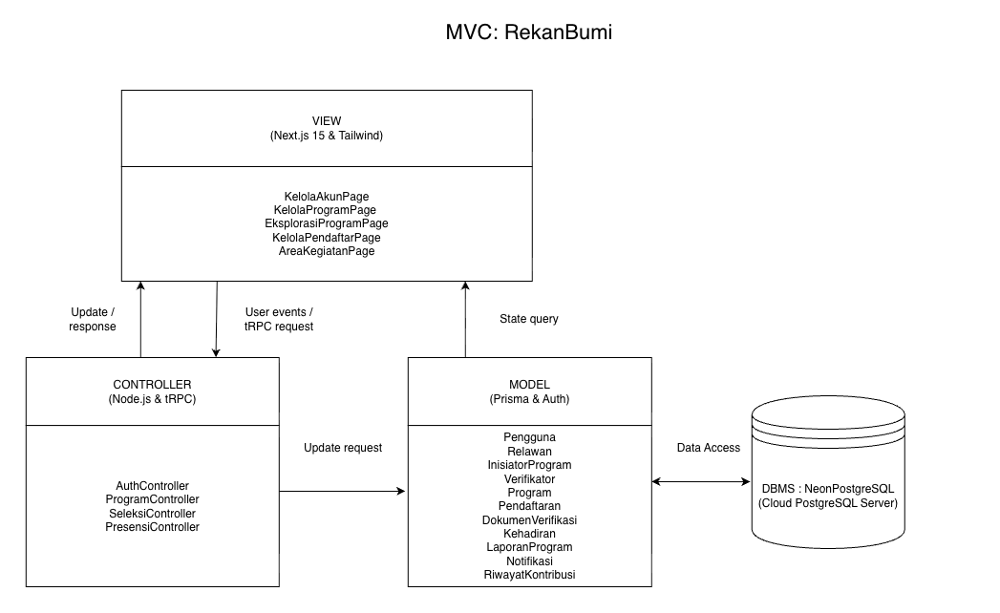
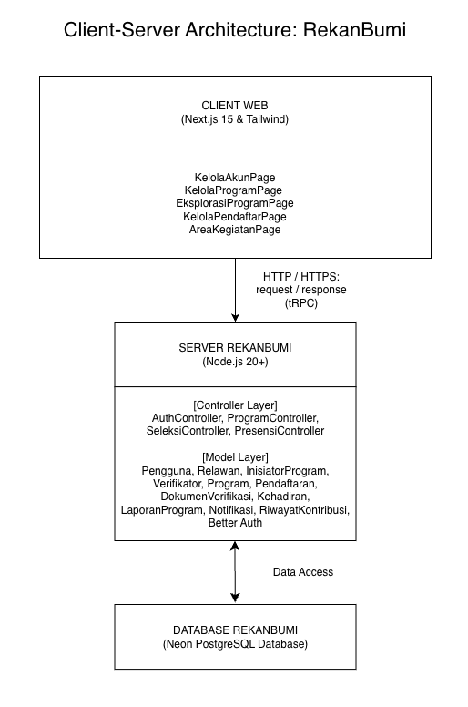
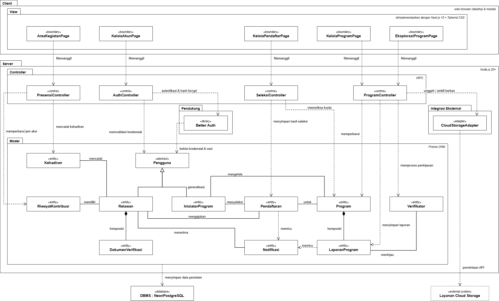

<h1>
IF2150 REKAYASA PERANGKAT LUNAK
 
TUGAS 6
 
ARSITEKTUR PERANGKAT LUNAK (APL)
</h1>
 

## RekanBumi

### Untuk: Stefani Angeline Oroh

Dipersiapkan oleh:
| Informasi | Keterangan |
| --- | --- |
| Kelas | K03 |
| Kelompok | G01  |

| NIM | Nama |
|---|---|
| 13525018 | Avicenna Ananda Musthafa |
| 13525045 | Ribka Kaylena Sanjaya |
| 13525063 | Kairenzo Vemil |
| 13525069 | Mulky Siraj Firizqi |
| 13525144 | Three Gie Gendhis Sekar Ayoe Jatmiko |

---

 
 

# BAB 1: Style/Pattern Arsitektur Acuan

Pada bagian ini, tentukan *architectural style* atau *pattern* yang menjadi acuan untuk aplikasi yang Anda kembangkan. Misalnya *layered architecture*, *client-server*, *repository*, *pipe and filter architecture*, atau MVC (*Model-View-Controller*).

<i>Gambar 1. Arsitektur MVC : RekanBumi </i>

<i>Gambar 2. Arsitektur Client-Server : RekanBumi </i>

## 1.1  Style/Pattern Arsitektur Acuan 

Arsitektur perangkat lunak RekanBumi menggunakan Client-Server Architecture sebagai gaya arsitektur dan Model-View-Controller (MVC) sebagai pola arsitektur pada interface. Kombinasi ini digunakan untuk memisahkan interaksi pengguna dengan proses pengolahan data yang dilakukan oleh server.

### 1.1.1 Client-Server Architecture 
Pada Client-Server, perangkat lunak dibagi menjadi dua bagian utama yaitu, client dan server. Client merupakan bagian yang berinteraksi langsung dengan pengguna dan mengirimkan permintaan kepada server. Server bertanggung jawab menerima permintaan, menjalankan proses bisnis, mengelola data, serta mengirimkan hasil pengolahan kepada client.

Jika diimplementasikan pada RekanBumi:
Client merupakan antarmuka web yang digunakan oleh Relawan, Inisiator Program, dan Verifikator untuk mengakses fungsi-fungsi RekanBumi.
Server menangani proses aplikasi, autentikasi, pengolahan data, validasi, serta komunikasi dengan basis data.
Database menyimpan data sistem secara terpusat sehingga data program, pengguna, pendaftaran, kehadiran, laporan, notifikasi, dan riwayat kontribusi dapat digunakan oleh berbagai client.

Pemisahan tersebut memungkinkan beberapa jenis pengguna mengakses layanan dan data yang sama melalui client masing-masing. RekanBumi sendiri merupakan platform web yang mempertemukan masyarakat umum dengan lembaga lingkungan terverifikasi melalui program "Jaga Alam" dan "Jaga Iklim".

### 1.1.2 Model-View-Controller (MVC)
Di dalam RekanBumi, pola MVC digunakan untuk memisahkan tanggung jawab antara antarmuka pengguna, pengendalian alur proses, dan representasi data.

**1. Model**
Model bertanggung jawab merepresentasikan dan mengelola data serta keadaan (state) yang digunakan oleh sistem. Pada RekanBumi, bagian Model direpresentasikan oleh kelas-kelas *Entity Class* , yaitu:
  - Program
  - Pendaftaran
  - Relawan
  - Pengguna
  - InisiatorProgram
  - Verifikator
  - DokumenVerifikasi
  - Kehadiran
  - LaporanProgram
  - Notifikasi
  - RiwayatKontribusi

Kelas-kelas tersebut menyimpan data utama yang digunakan dalam proses bisnis RekanBumi. Misalnya, Program menyimpan informasi program, Pendaftaran menyimpan data pendaftaran relawan, Kehadiran menyimpan catatan check-in, dan RiwayatKontribusi menyimpan riwayat jam aksi relawan. Daftar kelas dan pembagiannya sebagai Entity Class telah didefinisikan pada pemodelan kelas RekanBumi.

**2. View** 
View bertanggung jawab menyediakan antarmuka yang digunakan pengguna untuk melihat informasi dan memberikan masukan kepada sistem. Pada RekanBumi, bagian View direpresentasikan oleh kelas-kelas Boundary Class, yaitu:
  - KelolaAkunPage
  - KelolaProgramPage
  - EksplorasiProgramPage
  - KelolaPendaftarPage
  - AreaKegiatanPage

Contohnya, EksplorasiProgramPage digunakan oleh Relawan untuk mencari, menyaring, dan melihat detail program, sedangkan AreaKegiatanPage menyediakan antarmuka untuk melakukan *check-in* dan melihat portofolio kontribusi.

**3. Controller**
Controller bertanggung jawab menerima masukan dari View, menjalankan proses dan validasi yang diperlukan, serta menghubungkan View dengan Model. Pada RekanBumi, bagian Controller terdiri atas:

- AuthController
- ProgramController
- SeleksiController
- PresensiController

AuthController menangani autentikasi dan sesi pengguna, ProgramController menangani pembuatan, pencarian, detail, dan perubahan status program, SeleksiController menangani proses seleksi relawan dan pengecekan kuota, sedangkan PresensiController menangani validasi dan pencatatan kehadiran serta pembaruan riwayat jam aksi.

Dengan demikian, alur dasar MVC pada RekanBumi adalah:

**Pengguna → View → Controller → Model → Controller → View → Pengguna**

Sedangkan dalam konteks Client-Server:

**Client → Request → Server (MVC) → Database → Server → Response → Client**

## 1.2 Alasan Pemilihan
Pemilihan Client-Server Architecture didasarkan pada karakteristik RekanBumi sebagai perangkat lunak berbasis web yang digunakan oleh para aktor, yaitu Inisiator Program, Relawan, dan Verifikator. Ketiga aktor tersebut membutuhkan akses terhadap layanan dan data yang sama, seperti data program, pendaftaran relawan, status program, kehadiran, laporan, dan riwayat kontribusi. Oleh karena itu, pengelolaan data secara terpusat pada server sesuai dengan kebutuhan RekanBumi.

Client-Server juga sesuai dengan alur proses bisnis RekanBumi yang melibatkan banyak interaksi antara pengguna dan sistem. Relawan dapat mencari program, mendaftarkan diri, menerima notifikasi, dan melakukan check-in. Inisiator dapat membuat program, menyeleksi relawan, serta mengirimkan laporan kegiatan. Sementara itu, Verifikator melakukan verifikasi dan meninjau laporan program. Proses-proses tersebut membutuhkan server sebagai pusat pengolahan dan penyimpanan data.

Pemilihan MVC didasarkan pada banyaknya fungsi dan antarmuka yang dimiliki RekanBumi. Pemisahan antara View, Controller, dan Model memungkinkan setiap bagian memiliki tanggung jawab yang lebih terfokus. View menangani interaksi dengan pengguna, Controller menangani alur dan validasi proses, sedangkan Model menangani data dan keadaan sistem.

MVC juga sesuai dengan pembagian kelas yang telah dibuat pada pemodelan kelas. RekanBumi telah memiliki Boundary Class, Controller Class, dan Entity Class yang dapat dipetakan secara langsung ke View, Controller, dan Model.

Selain itu, pola ini mendukung kebutuhan fungsional RekanBumi yang melibatkan proses seperti pencarian dan penyaringan program (KF03 dan KF04), validasi pendaftaran (KF05 dan KF10), autentikasi (KF06), seleksi relawan (KF07 dan KF09), notifikasi (KF08), check-in (KF11 dan KF12), serta pembaruan status program dan riwayat kontribusi (KF13–KF15).

Dari sisi kebutuhan non-fungsional, pemisahan tanggung jawab pada Client-Server dan MVC juga mendukung kebutuhan **performance efficiency, security, reliability, compatibility, interaction capability,** dan **flexibility** yang tercantum dalam SKPL. Misalnya, proses pencarian dapat diproses oleh server untuk memenuhi target waktu respons, autentikasi dapat dipusatkan pada server, sedangkan View dapat dirancang agar kompatibel dengan berbagai ukuran layar dan peramban.

## 1.3 Lingkungan Operasi Perangkat Lunak
Lingkungan operasi perangkat lunak yang tertera di bawah merupakan sama dengan lingkungan yang tertera pada SKPL.
| Komponen | Spesifikasi |
| :--- | :--- |
| Server | Node.js 20+|
| Client | Web browser modern pada perangkat desktop dan mobile |
| DBMS | Neon PostgreSQL |
| OS | Cross-platform melalui web browser pada perangkat desktop dan mobile |
| Frontend | Next.js 15 dan Tailwind CSS |
| Authentication | Better Auth |
| ORM | Prisma |
| API | tRPC |

Teknologi yang digunakan mendukung penerapan Client-Server Architecture dan MVC. Next.js 15 dan Tailwind CSS digunakan pada sisi frontend sebagai bagian yang menyediakan antarmuka kepada client. Node.js 20+ menjadi lingkungan server untuk menjalankan aplikasi. tRPC digunakan sebagai mekanisme komunikasi antara client dan server untuk mengakses fungsi aplikasi.

Pada sisi pengelolaan data, Prisma berperan sebagai ORM yang menjembatani aplikasi dengan Neon PostgreSQL sebagai DBMS. Dengan demikian, data yang dikelola oleh Model dapat disimpan secara terpusat pada server. Better Auth digunakan untuk mendukung kebutuhan autentikasi pengguna pada aplikasi.

Kombinasi teknologi tersebut sesuai dengan arsitektur yang dipilih karena client mengakses layanan aplikasi melalui server, sementara pengelolaan antarmuka, proses aplikasi, dan data dapat dipisahkan berdasarkan tanggung jawab masing-masing komponen dalam penerapan MVC.

---

# BAB 2: Identifikasi Komponen / Modul / Subsistem

Pada bagian ini, dilakukan identifikasi terhadap komponen dan subsistem yang menyusun perangkat lunak RekanBumi. Pengelompokan komponen didasarkan pada perpaduan *Client-Server Architecture* dan pola *Model-View-Controller* (MVC) yang telah ditetapkan pada BAB 1.

Tabel di bawah ini mendefinisikan rincian komponen yang membentuk arsitektur sistem, sekaligus memetakan setiap elemen secara hierarkis dengan antarmuka, pengontrol, dan kelas entitas yang telah dirancang pada dokumen SKPL sebelumnya.

Tabel 2.1. Identifikasi Komponen/Modul/Subsistem

| Nama Komponen/Modul/Subsistem | Jenis | Penjelasan |
| :--- | :--- | :--- |
| *KelolaAkunPage* | *Client (View)* | Menampilkan formulir pendaftaran dan masuk akun pada peramban klien, serta meneruskan interaksi ke *AuthController*. |
| *KelolaProgramPage* | *Client (View)* | Menampilkan antarmuka bagi Inisiator untuk mendaftarkan program baru beserta dokumennya, dan mengunggah laporan akhir. |
| *EksplorasiProgramPage* | *Client (View)* | Menampilkan katalog, fitur pencarian, filter kategori "Jaga Alam" dan "Jaga Iklim", serta detail informasi program aksi kepada Relawan. |
| *KelolaPendaftarPage* | *Client (View)* | Menampilkan daftar calon relawan pendaftar dan menyediakan antarmuka bagi Inisiator untuk memasukkan keputusan hasil seleksi. |
| *AreaKegiatanPage* | *Client (View)* | Menampilkan antarmuka eksekusi *check-in* kehadiran di lokasi dan halaman peninjauan riwayat portofolio jam aksi relawan. |
| *AuthController* | *Server (Controller)* | Menerima permintaan dari klien, memvalidasi kredensial keamanan, memproses pembuatan akun, dan mengelola rute sesi. |
| *ProgramController* | *Server (Controller)* | Mengeksekusi logika bisnis terkait pencarian program, validasi unggahan data program baru, dan pembaruan status laporan. |
| *SeleksiController* | *Server (Controller)* | Mengeksekusi logika validasi ketersediaan kuota program, menyimpan status seleksi relawan, dan memicu notifikasi. |
| *PresensiController* | *Server (Controller)* | Memvalidasi kesesuaian rentang waktu *check-in* kegiatan dan mengeksekusi kalkulasi penambahan portofolio relawan. |
| *Pengguna* | *Server (Model)* | Merepresentasikan data kredensial autentikasi (email dan kata sandi) dari entitas akun platform. |
| *Relawan* | *Server (Model)* | Merepresentasikan data profil dan metrik jam aksi individu masyarakat umum. |
| *InisiatorProgram* | *Server (Model)* | Merepresentasikan data profil dan tautan situs resmi dari lembaga atau komunitas lingkungan. |
| *Verifikator* | *Server (Model)* | Merepresentasikan data entitas pengelola sistem yang bertugas meninjau laporan. |
| *Program* | *Server (Model)* | Merepresentasikan data detail kegiatan, jadwal, kategori, kuota, dan status keberlangsungan. |
| *Pendaftaran* | *Server (Model)* | Merepresentasikan data keterampilan, ketersediaan waktu, dan status seleksi calon relawan. |
| *DokumenVerifikasi* | *Server (Model)* | Merepresentasikan data dan status validasi dari dokumen legalitas yang diunggah inisiator. |
| *Kehadiran* | *Server (Model)* | Merepresentasikan catatan waktu (*timestamp*) konfirmasi kehadiran relawan di lokasi program. |
| *LaporanProgram* | *Server (Model)* | Merepresentasikan data dokumentasi akhir, catatan capaian, dan catatan revisi kegiatan. |
| *Notifikasi* | *Server (Model)* | Merepresentasikan entitas pemberitahuan otomatis berserta status keterbacaannya. |
| *RiwayatKontribusi* | *Server (Model)* | Merepresentasikan data akumulasi jam aksi dan daftar program yang telah diselesaikan relawan. |
| *Better Auth* | *Server (Pendukung)* | Komponen pendukung autentikasi yang diintegrasikan di lapisan model pada peladen (*server*). |
| *DBMS : NeonPostgreSQL* | *Penyimpanan Data* | Relasional DBMS berbasis komputasi awan yang menyimpan seluruh skema data sistem secara persisten. |
| *CloudStorageAdapter* | *Integrasi Eksternal* | Komponen pengelola API eksternal untuk menyimpan dan mengambil berkas dokumen legalitas serta foto laporan. |

---

# BAB 3: Model Arsitektur Perangkat Lunak

*Architectural View* adalah bagaimana cara kita melihat/mendeskripsikan arsitektur sebuah sistem dari sudut pandang tertentu. Dalam perancangan arsitektur aplikasi, dibutuhkan *Architectural View* yang dapat mempermudah pemahaman dari proses aplikasi yang akan dikembangkan. Tujuan dari *Architectural View* adalah menjadi bahan komunikasi, pemisahan masalah, mempermudah analisis, dan pemandu saat eksekusi pengembangan sistem tersebut.

Buatlah model arsitektur dari aplikasi yang akan dirancang dalam bentuk *view*. Model arsitektur ini berfungsi untuk memperlihatkan bagaimana setiap komponen, modul, dan subsistem saling berinteraksi serta berkolaborasi dalam menjalankan fungsi utama sistem secara keseluruhan. Anda dapat membuat satu atau lebih *view* tergantung kebutuhan dalam bentuk gambar. Pilihlah notasi yang sesuai. Contoh *view* yang dapat digunakan antara lain ***Logical View***, ***Process View***, ***Development View***, serta ***Physical View***.

Ketentuan pengisian BAB 3:
1. Setiap view menggambarkan **keseluruhan sistem**, bukan satu use case atau satu fitur saja.
2. Buat **minimal satu view**. Setiap view dituliskan dalam subbab tersendiri (3.1, 3.2, dan seterusnya). Tidak perlu membuat keempat view, pilih yang paling membantu menjelaskan P/L Anda, lalu jelaskan alasan pemilihannya.
3. Setiap view harus **konsisten dengan BAB 2**. Seluruh komponen pada Tabel 2.1 harus muncul dengan nama yang sama, dan tidak boleh ada komponen pada view yang tidak terdaftar di Tabel 2.1.
4. Setiap view harus **mencerminkan style/pattern pada BAB 1**. Misalnya, jika memilih MVC, pembagian *Model*, *View*, dan *Controller* harus terlihat jelas pada diagram.
5. Jika membuat lebih dari satu view, setiap view harus menggambarkan sistem yang sama dari sudut pandang berbeda. View tambahan melengkapi view pertama, bukan mengulanginya.
6. Beri label pada setiap garis atau panah yang menghubungkan komponen agar hubungan antarkomponen dapat dipahami tanpa penjelasan tambahan.
7. Jika membuat *Physical View*, gambarkan lingkungan operasi pada Tabel 1.1.

## 3.1 Logical View

*Logical View* menggambarkan abstraksi utama perangkat lunak RekanBumi beserta hubungan antarkomponennya dalam mendukung kebutuhan fungsional. *View* ini disajikan menggunakan *class diagram* dengan pengelompokan komponen berdasarkan *Client-Server Architecture* sebagai struktur sistem secara keseluruhan. Pada sisi aplikasi, tanggung jawab komponen diorganisasi lebih lanjut menggunakan pola *Model-View-Controller* (MVC), dengan stereotipe «boundary» untuk *View*, «control» untuk *Controller*, dan «entity» untuk *Model*.

*Logical View* dipilih karena RekanBumi memiliki sejumlah fungsi yang saling berkaitan dan menggunakan data bersama, seperti *Program*, *Pendaftaran*, *Kehadiran*, dan *LaporanProgram*. Melalui *view* ini, hubungan antara antarmuka, logika aplikasi, dan entitas domain dapat ditelusuri untuk menunjukkan bagaimana kebutuhan fungsional pada SKPL direalisasikan oleh komponen perangkat lunak. RekanBumi juga digunakan oleh tiga aktor, yaitu Relawan, Inisiator Program, dan Verifikator, yang memakai layanan berbeda tetapi berinteraksi dengan model data yang saling berkaitan. Selain itu, stereotipe *Boundary*, *Control*, dan *Entity* pada pemodelan kelas SKPL selaras dengan pembagian tanggung jawab *View*, *Controller*, dan *Model*, sehingga rancangan pada APL tetap konsisten dengan *baseline* SKPL.

<i>Gambar 3. Logical View RekanBumi</i>

Gambar 3 menunjukkan *package* Client yang memuat komponen *View* serta *package* Server yang memuat *Controller*, *Model*, *Better Auth* sebagai pendukung autentikasi, dan *CloudStorageAdapter* sebagai perantara ke Layanan *Cloud Storage*. Relasi "Memanggil" menunjukkan permintaan dari *View* ke *Controller* melalui tRPC, sedangkan relasi dari *Controller* ke *Model* digambarkan sebagai dependensi dengan label sesuai operasinya. Hubungan antarentitas *Model* mengacu pada Diagram Kelas Keseluruhan pada SKPL, dan data persisten diakses melalui Prisma ORM serta disimpan pada DBMS Neon PostgreSQL.

<b><i>Catatan</i></b>: <i>Ganti XXX dengan nama view yang dibuat, misalnya Logical View. Gambar 2 hanya contoh untuk P/L e-commerce, ganti dengan view milik kelompok Anda yang memuat seluruh komponen pada Tabel 2.1. Jenis view dan notasinya boleh berbeda dari contoh. Jika membuat view tambahan, lanjutkan pola 3.x ini (3.2, 3.3, dan seterusnya).</i>

---

# Referensi

- Sommerville, I. (2016). *Software Engineering* (10th ed.). Pearson. Chapter 6: *Architectural Design*: [https://software-engineering-book.com/slides/](https://software-engineering-book.com/slides/)
- Diagram arsitektur: [https://www.drawio.com/](https://www.drawio.com/), [https://staruml.io/](https://staruml.io/)
